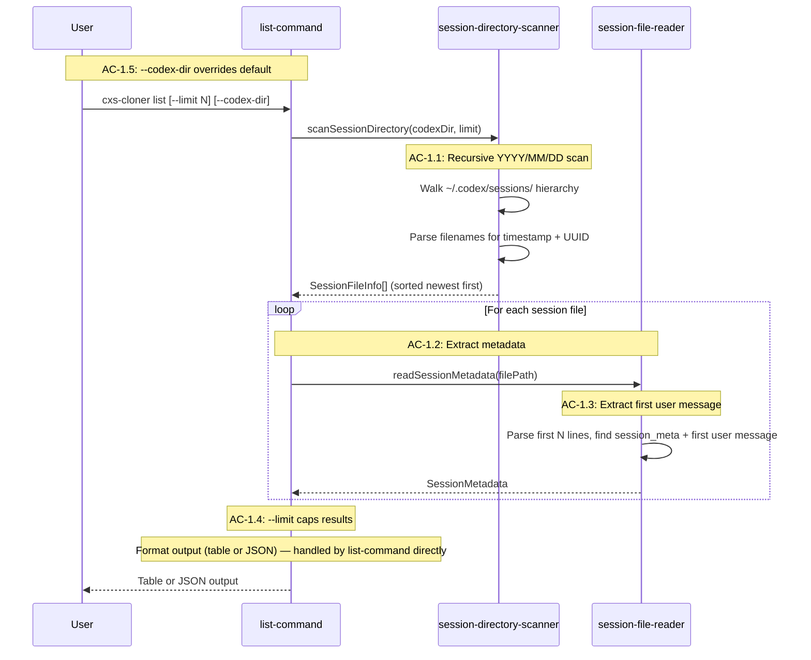

# Story 1: Session Discovery and List Command

## Objective

After this story ships, a user can run `cxs-cloner list` and see their Codex sessions sorted by recency, with metadata (date, working directory, first user message, file size). They can limit results and override the Codex directory path.

## Scope

### In Scope

- Filesystem scanning of `~/.codex/sessions/YYYY/MM/DD/` hierarchy
- Filename parsing to extract timestamp and UUID
- Session metadata extraction from `session_meta` record (lightweight read — first N lines only)
- First user message extraction (from `response_item` with user role, falling back to `event_msg` of subtype `user_message`)
- `cxs-cloner list` command with `--limit`, `--codex-dir`, `--json`, and `--verbose` flags
- Non-strict malformed JSON handling (skip bad lines with warning for list/info contexts)
- CLI entry point (`cli.ts`) with arg normalization
- Root command with subcommands (`main-command.ts`)

### Out of Scope

- Full JSONL parsing with all record type discrimination (Story 2)
- Partial UUID session lookup (Story 2)
- Session statistics computation (Story 2)
- Info command (Story 2)
- Clone command (Story 5)

## Dependencies / Prerequisites

- Story 0 must be complete (types, error classes, project config, fixtures)

## Acceptance Criteria

**AC-1.1:** The system SHALL scan `~/.codex/sessions/` recursively through the `YYYY/MM/DD/` hierarchy to discover session files.

- **TC-1.1.1: Two sessions in one date directory**
  - Given: A `~/.codex/sessions/2026/02/28/` directory containing two `.jsonl` files
  - When: `list` is called
  - Then: Both sessions are returned
- **TC-1.1.2: Sessions across multiple date directories sorted newest first**
  - Given: Sessions across multiple date directories (`2026/01/15/`, `2026/02/28/`)
  - When: `list` is called
  - Then: Sessions are returned sorted newest first
- **TC-1.1.3: Empty sessions directory returns empty result**
  - Given: An empty sessions directory
  - When: `list` is called
  - Then: An empty result is returned with no error

**AC-1.2:** The system SHALL extract session metadata from the filename and `session_meta` record.

- **TC-1.2.1: Filename parsing extracts timestamp and UUID**
  - Given: A file named `rollout-2026-02-28T14-30-00-<uuid>.jsonl`
  - When: Metadata is extracted
  - Then: `created_at` matches `2026-02-28T14:30:00` and `thread_id` matches `<uuid>`
- **TC-1.2.2: session_meta record fields accessible**
  - Given: A session file with a `session_meta` record containing `cwd`, `model_provider`, `cli_version`, and `git` fields
  - When: Metadata is extracted
  - Then: All fields are available

**AC-1.3:** The system SHALL extract the first user message for display.

- **TC-1.3.1: First user message from response_item**
  - Given: A session with a `response_item` of type `message` with `role: "user"`
  - When: The first message is extracted
  - Then: The text content is returned truncated to 80 characters
- **TC-1.3.2: First user message fallback to event_msg**
  - Given: A session with an `event_msg` of subtype `user_message` but no user `response_item`
  - When: The first message is extracted
  - Then: The `event_msg` message text is used as fallback

**AC-1.4:** The system SHALL support a `--limit` flag to cap the number of sessions returned.

- **TC-1.4.1: Limit caps returned sessions**
  - Given: 50 sessions and `--limit 10`
  - When: `list` is called
  - Then: Exactly 10 sessions are returned (newest first)

**AC-1.5:** The system SHALL support a `--codex-dir` flag to override the default `~/.codex` directory.

- **TC-1.5.1: codex-dir override scans custom path**
  - Given: `--codex-dir /tmp/test-codex`
  - When: `list` is called
  - Then: Sessions are scanned from `/tmp/test-codex/sessions/`

**AC-3.3 (partial):** The system SHALL handle malformed JSON in list/info by skipping with a warning.

- **TC-3.3.1: Malformed JSON in list/info skipped with warning**
  - Given: A malformed JSON line when running `list` or `info`
  - When: The line is encountered during parsing
  - Then: The line is skipped with a warning and processing continues

## Error Paths

| Scenario | Expected Response |
|----------|------------------|
| Sessions directory does not exist | Error: "Codex sessions directory not found at {path}" |
| Sessions directory exists but is empty | Empty result, no error |
| Non-JSONL files in session directories | Skipped (only `.jsonl` files processed) |
| Malformed JSON lines in session files | Skipped with warning, processing continues |

## Definition of Done

- [ ] All ACs met
- [ ] All TC conditions verified
- [ ] `cxs-cloner list` works against real Codex sessions
- [ ] `--limit`, `--codex-dir`, `--json`, `--verbose` flags functional
- [ ] PO accepts

---

## Technical Implementation

### Architecture Context

This story implements the session discovery pipeline and the first CLI command (`list`). It establishes the CLI entry point, arg normalization, and the IO modules for filesystem scanning and lightweight session reading.

**Modules and Responsibilities:**

| Module | Path | Responsibility | AC Coverage |
|--------|------|----------------|-------------|
| `session-directory-scanner` | `src/io/session-directory-scanner.ts` | Scan `~/.codex/sessions/` hierarchy, find JSONL files, extract metadata from filenames, sort by date descending, apply limit | AC-1.1, AC-1.4, AC-1.5 |
| `session-file-reader` (partial) | `src/io/session-file-reader.ts` | Read first N lines of session file, parse `session_meta` record, extract first user message. Non-strict: skip bad JSON with warning. | AC-1.2, AC-1.3, AC-3.3 (TC-3.3.1) |
| `list-command` | `src/commands/list-command.ts` | Wire citty command for `list`. Invoke scanner + reader. Format output (table or JSON). `--verbose` shows additional metadata (model, cwd, git branch). | UF-1 |
| `main-command` | `src/commands/main-command.ts` | Root citty command with subcommands | (supports all commands) |
| `cli.ts` | `src/cli.ts` | Shebang entrypoint, delegates to normalize-args | (supports all commands) |
| `normalize-args` | `src/cli/normalize-args.ts` | Pre-citty arg preprocessing for boolean/string flag handling | (supports all commands) |

**List Sessions Flow (UF-1, from Tech Design §Flow 1):**



**Note:** The list-command handles its own output formatting directly (table or JSON). The `clone-result-formatter` module (Story 5) is a separate concern for clone statistics output.

**Filename Convention:**

Session files follow the naming pattern `rollout-<timestamp>-<uuid>.jsonl` within the `~/.codex/sessions/YYYY/MM/DD/` directory hierarchy. The scanner parses filenames with regex to extract the timestamp and UUID, which forms the `SessionFileInfo` returned for each file. Date hierarchy dirs are walked in reverse for newest-first ordering.

**Malformed JSON Handling in List Context (AC-3.3 partial):**

For `list` and `info` commands, malformed JSON lines are skipped with a warning and processing continues. This is the non-strict parse mode. The reader logs a warning (via consola) and moves to the next line. This ensures a single malformed line doesn't prevent listing all sessions.

### Interfaces & Contracts

**Creates:**

```typescript
// src/io/session-directory-scanner.ts
export async function scanSessionDirectory(
  codexDir: string,
  options?: ScanOptions,
): Promise<SessionFileInfo[]>;
// Walks ~/.codex/sessions/YYYY/MM/DD/ hierarchy.
// Returns SessionFileInfo[] sorted newest first.
// Applies options.limit if provided.
// Throws CxsError if sessions directory doesn't exist.

// src/io/session-file-reader.ts (partial — metadata-only read)
export async function readSessionMetadata(
  filePath: string,
): Promise<SessionMetadata>;
// Reads first N lines, extracts session_meta and first user message.
// Non-strict: skips malformed JSON lines with warning.
// First user message: looks for response_item with role="user",
// falls back to event_msg of subtype "user_message".
// Truncates message text to 80 characters.

// src/commands/list-command.ts
// citty defineCommand(...) for "list" subcommand
// Flags: --limit (number), --codex-dir (string), --json (boolean), --verbose (boolean)

// src/commands/main-command.ts
// citty defineCommand(...) root command with subcommands: list, info, clone

// src/cli.ts
// Shebang entrypoint: #!/usr/bin/env bun
// Delegates to normalize-args → citty main-command

// src/cli/normalize-args.ts
// Pre-process argv for citty boolean/string flag handling
```

**Consumes (from Story 0):**

```typescript
// src/types/clone-operation-types.ts
export interface SessionFileInfo {
  filePath: string;
  threadId: string;
  createdAt: Date;
  fileName: string;
}

export interface SessionMetadata {
  threadId: string;
  createdAt: Date;
  cwd: string;
  cliVersion: string;
  modelProvider?: string;
  git?: GitInfo;
  firstUserMessage?: string;
  fileSizeBytes: number;
}

export interface ScanOptions {
  limit?: number;
}

// src/types/codex-session-types.ts
export interface SessionMetaPayload { ... }
export interface EventMsgPayload { ... }
export interface MessagePayload { ... }

// src/errors/clone-operation-errors.ts
export class CxsError extends Error { ... }
```

### TC -> Test Mapping

| TC | Test File | Test Description | Approach |
|----|-----------|------------------|----------|
| TC-1.1.1 | `test/io/session-directory-scanner.test.ts` | TC-1.1.1: discovers sessions in date directory | Create temp dir `sessions/2026/02/28/` with 2 JSONL files. Call `scanSessionDirectory`. Assert returns 2 entries. |
| TC-1.1.2 | `test/io/session-directory-scanner.test.ts` | TC-1.1.2: sorts sessions newest first across date dirs | Create files across `2026/01/15/` and `2026/02/28/`. Call `scanSessionDirectory`. Assert first result is from `02/28`. |
| TC-1.1.3 | `test/io/session-directory-scanner.test.ts` | TC-1.1.3: returns empty for empty directory | Create empty temp sessions dir. Call `scanSessionDirectory`. Assert returns `[]`. |
| TC-1.2.1 | `test/io/session-directory-scanner.test.ts` | TC-1.2.1: extracts timestamp and UUID from filename | Create file named `rollout-2026-02-28T14-30-00-<uuid>.jsonl`. Call `scanSessionDirectory`. Assert `createdAt` and `threadId` match. |
| TC-1.2.2 | `test/io/session-file-reader.test.ts` | TC-1.2.2: extracts metadata fields from session_meta | Write JSONL with `session_meta` containing `cwd`, `model_provider`, `cli_version`, `git`. Call `readSessionMetadata`. Assert all fields accessible. |
| TC-1.3.1 | `test/io/session-file-reader.test.ts` | TC-1.3.1: extracts first user message truncated to 80 chars | Write session with user `response_item` message >80 chars. Call `readSessionMetadata`. Assert `firstUserMessage` truncated to 80. |
| TC-1.3.2 | `test/io/session-file-reader.test.ts` | TC-1.3.2: falls back to event_msg for first user message | Write session with no user `response_item`, but with `user_message` `event_msg`. Call `readSessionMetadata`. Assert event message text used. |
| TC-1.4.1 | `test/io/session-directory-scanner.test.ts` | TC-1.4.1: limit caps returned sessions | Create 50 JSONL files. Call `scanSessionDirectory` with `{ limit: 10 }`. Assert returns exactly 10 (newest). |
| TC-1.5.1 | `test/io/session-directory-scanner.test.ts` | TC-1.5.1: codex-dir override scans custom path | Create custom dir structure. Call `scanSessionDirectory` with custom `codexDir`. Assert scans from custom path. |
| TC-3.3.1 | `test/io/session-file-reader.test.ts` | TC-3.3.1: skips malformed JSON with warning in non-strict mode | Write JSONL with one malformed line among valid lines. Call `readSessionMetadata`. Assert bad line skipped, valid data returned. |

### Non-TC Decided Tests

| Test File | Test Description | Source |
|-----------|------------------|--------|
| `test/io/session-directory-scanner.test.ts` | Scanner handles non-JSONL files in session directories (skips them) | Tech Design §Chunk 1 Non-TC Decided Tests |
| `test/io/session-directory-scanner.test.ts` | Scanner handles symlinks (follow and include) | Tech Design §Chunk 1 Non-TC Decided Tests |
| `test/io/session-file-reader.test.ts` | Reader handles empty files gracefully | Tech Design §Chunk 1 Non-TC Decided Tests |

### Risks & Constraints

- Filename regex must match the exact Codex naming convention (`rollout-<timestamp>-<uuid>.jsonl`). Deviation in naming from Codex updates would break discovery. Validated against Codex source.
- `readSessionMetadata` reads only the first N lines for performance — if `session_meta` or the first user message appears deeper (unusual but possible in edge cases), it would be missed. Acceptable tradeoff for list performance.
- `user_message` event_msg fallback: relies on the `type` field within the event payload having the value `"user_message"`. This is canonical per the Codex protocol but if Codex changes the event type naming, the fallback would fail silently.
- This story does NOT implement partial UUID lookup — that's Story 2.

### Spec Deviation

None. Checked against Tech Design: §Flow 1: List Sessions, §Module Responsibility Matrix (scanner, reader rows), §Low Altitude — SessionFileInfo/SessionMetadata interfaces, §Low Altitude — ScanOptions, §Chunk 1 scope and TC mapping.

## Technical Checklist

- [ ] All TCs have passing tests (10 TCs)
- [ ] Non-TC decided tests pass (3 tests)
- [ ] TypeScript compiles clean (`bun run typecheck`)
- [ ] Lint/format passes (`bun run format:check && bun run lint`)
- [ ] No regressions on Story 0 (`bun test`)
- [ ] CLI entry point works: `bun run src/cli.ts list`
- [ ] Verification: `bun run verify`
- [ ] Spec deviations documented (if any)
