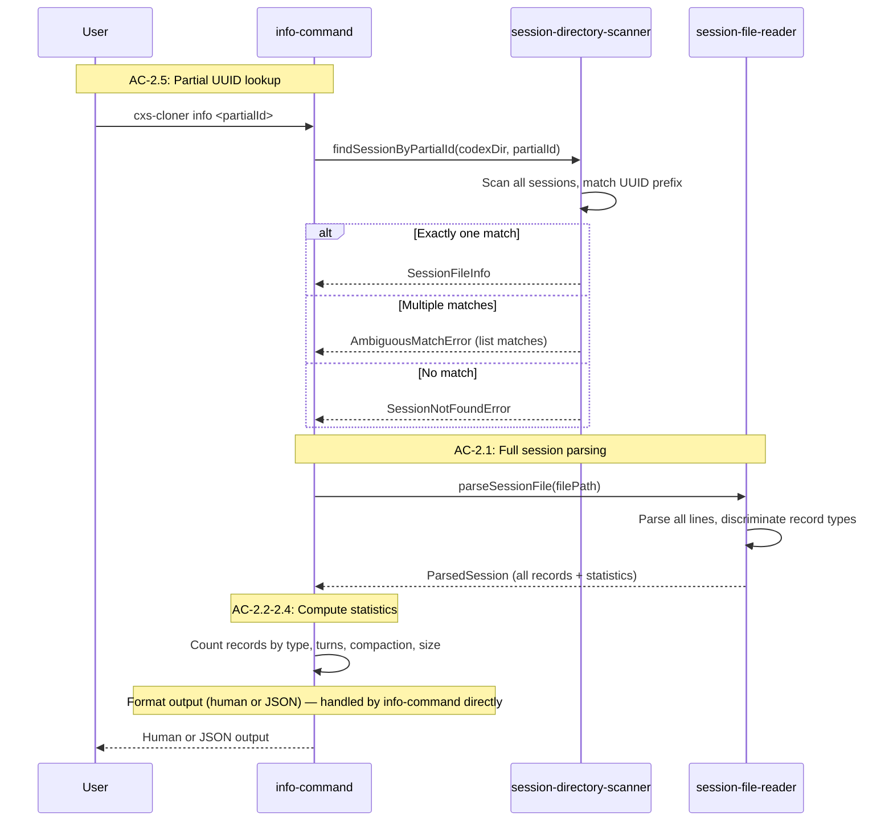

# Story 2: Session Parser and Info Command

## Objective

After this story ships, a user can run `cxs-cloner info <sessionId>` (with partial UUID matching) and see detailed session statistics: record counts by type, turn count, compaction status, file size with estimated token count. The full JSONL parser correctly discriminates all five record types and all `response_item` subtypes.

## Scope

### In Scope

- Full JSONL parsing with record type discrimination (`session_meta`, `response_item`, `turn_context`, `event_msg`, `compacted`)
- Polymorphic `response_item` subtype handling (all 10+ subtypes)
- Unknown record types and unknown `response_item` subtypes preserved as passthrough with debug log
- Record-level statistics computation (counts by type, turn count from `turn_context` records, compaction status, file size, estimated token count)
- Partial UUID session lookup (exact prefix match, ambiguous match error, not-found error)
- `cxs-cloner info <sessionId>` command with `--codex-dir`, `--json`, `--verbose` flags
- Strict and force parse modes (abort on malformed JSON vs. skip with warning)

### Out of Scope

- Turn boundary identification for stripping purposes (Story 3)
- Record stripping algorithm (Story 4)
- Clone command (Story 5)

## Dependencies / Prerequisites

- Story 0 must be complete (types, error classes)
- Story 1 must be complete (session directory scanner, partial reader implementation)

## Acceptance Criteria

**AC-2.1:** The system SHALL parse a complete session JSONL file and report record-level statistics.

- **TC-2.1.1: Function call count reported**
  - Given: A session with 10 `response_item` records of type `function_call`
  - When: `info` is called
  - Then: `function_calls: 10` is reported
- **TC-2.1.2: Reasoning block count reported**
  - Given: A session with 3 `response_item` records of type `reasoning`
  - When: `info` is called
  - Then: `reasoning_blocks: 3` is reported
- **TC-2.1.3: Event message count reported**
  - Given: A session with 50 `event_msg` records
  - When: `info` is called
  - Then: `event_messages: 50` is reported

**AC-2.2:** The system SHALL report compaction status.

- **TC-2.2.1: Compacted records with positions reported**
  - Given: A session with 2 `compacted` records
  - When: `info` is called
  - Then: `compacted_records: 2` is reported with their line positions
- **TC-2.2.2: No compaction reported**
  - Given: A session with 0 `compacted` records
  - When: `info` is called
  - Then: `compacted: none` is reported

**AC-2.3:** The system SHALL report turn count.

- **TC-2.3.1: Turn count from turn_context records**
  - Given: A session with 5 `turn_context` records
  - When: `info` is called
  - Then: `turns: 5` is reported

**AC-2.4:** The system SHALL report file size and estimated token count.

- **TC-2.4.1: File size and token estimate**
  - Given: A session file of 100,000 bytes
  - When: `info` is called
  - Then: File size is reported as `~98 KB` and estimated tokens as `~25,000` (using 4 bytes/token heuristic)

**AC-2.5:** The system SHALL find sessions by partial UUID match.

- **TC-2.5.1: Partial UUID prefix matches session**
  - Given: A session with UUID `019ba2c8-d0d3-7a12-9483-256375a8b26a` and input `019ba2c8`
  - When: `info` is called
  - Then: The session is found
- **TC-2.5.2: Ambiguous partial ID returns error with matches**
  - Given: A partial ID that matches multiple sessions
  - When: `info` is called
  - Then: An error is returned listing the ambiguous matches

**AC-3.1:** The system SHALL parse all five record types (`session_meta`, `response_item`, `turn_context`, `event_msg`, `compacted`).

- **TC-3.1.1: session_meta parsed with accessible fields**
  - Given: A line with `"type": "session_meta"`
  - When: Parsed
  - Then: `payload.id`, `payload.cwd`, and `payload.cli_version` are accessible
- **TC-3.1.2: function_call response_item parsed with accessible fields**
  - Given: A line with `"type": "response_item"` and `"payload": {"type": "function_call", ...}`
  - When: Parsed
  - Then: `payload.name`, `payload.arguments`, and `payload.call_id` are accessible
- **TC-3.1.3: reasoning response_item parsed with accessible fields**
  - Given: A line with `"type": "response_item"` and `"payload": {"type": "reasoning", ...}`
  - When: Parsed
  - Then: `payload.summary` and `payload.encrypted_content` are accessible
- **TC-3.1.4: Unknown record types preserved as passthrough**
  - Given: Unknown record types or unknown `response_item` subtypes
  - When: Parsed
  - Then: The record is preserved as-is (passthrough) with a debug-level log

**AC-3.2:** The system SHALL handle `response_item` polymorphism correctly.

- **TC-3.2.1: All response_item subtypes correctly discriminated**
  - Given: response_items with subtypes `message`, `function_call`, `function_call_output`, `reasoning`, `local_shell_call`, `custom_tool_call`, `custom_tool_call_output`, `web_search_call`, `ghost_snapshot`, `compaction`
  - When: Parsed
  - Then: Each subtype is correctly identified by `payload.type`

**AC-3.3 (partial):** The system SHALL handle malformed JSON in clone-relevant parse modes.

- **TC-3.3.2: Malformed JSON in clone strict mode aborts**
  - Given: A malformed JSON line when running `clone` (strict mode)
  - When: The line is encountered during parsing
  - Then: The operation aborts with an error identifying the malformed line number
- **TC-3.3.3: Malformed JSON in clone force mode skips**
  - Given: A malformed JSON line when running `clone --force`
  - When: The line is encountered during parsing
  - Then: The line is skipped with a warning, and the output omits it

## Error Paths

| Scenario | Expected Response |
|----------|------------------|
| Session not found by partial ID | `SessionNotFoundError` with partial ID |
| Ambiguous partial ID | `AmbiguousMatchError` listing matching session IDs |
| Empty partial ID | Error: invalid session ID |
| Session file with only session_meta (no turns) | Statistics reported with zero turns, zero tool calls |
| Malformed JSON in strict mode | `MalformedJsonError` with file path and line number |

## Definition of Done

- [ ] All ACs met
- [ ] All TC conditions verified
- [ ] `cxs-cloner info <partialId>` works against real Codex sessions
- [ ] Full record type discrimination covers all known subtypes
- [ ] Unknown types preserved as passthrough (forward compatibility)
- [ ] PO accepts

---

## Technical Implementation

### Architecture Context

This story completes the JSONL parsing layer and adds the `info` command. It extends the `session-file-reader` from Story 1 (which did lightweight metadata-only reads) to support full session parsing with record type discrimination across all five record types and all `response_item` subtypes. It also adds partial UUID lookup to the `session-directory-scanner`.

**Modules and Responsibilities:**

| Module | Path | Responsibility | AC Coverage |
|--------|------|----------------|-------------|
| `session-file-reader` (full) | `src/io/session-file-reader.ts` | Full JSONL parsing: parse all lines, discriminate on `type` field (5 record types), discriminate `response_item` on `payload.type` (10+ subtypes), compute statistics, handle strict/non-strict/force parse modes | AC-2.1, AC-2.2, AC-2.3, AC-2.4, AC-3.1, AC-3.2, AC-3.3 |
| `session-directory-scanner` (additions) | `src/io/session-directory-scanner.ts` | `findSessionByPartialId`: scan all sessions, filter by UUID prefix, handle 0/1/many matches | AC-2.5 |
| `info-command` | `src/commands/info-command.ts` | Wire citty command for `info`. Accept partial session ID. Invoke scanner (partial ID lookup) + reader (full parse). Format statistics output. | UF-2 |

**Inspect Session Flow (UF-2, from Tech Design §Flow 2):**



**Note:** The info-command handles its own output formatting directly. The `clone-result-formatter` module (Story 5) is a separate concern for clone statistics output.

**Record Type Discrimination:**

The JSONL parser uses a two-level tagging pattern. The first level is `RolloutLine.type` which discriminates the five record types. For `response_item` records, the second level is `payload.type` which discriminates 10+ subtypes.

```
Line.type                   → Payload discriminator
────────────────────────────────────────────────────
"session_meta"             → SessionMetaPayload
"response_item"            → payload.type:
                              "message"              → MessagePayload
                              "reasoning"            → ReasoningPayload
                              "function_call"        → FunctionCallPayload
                              "function_call_output"  → FunctionCallOutputPayload
                              "local_shell_call"      → LocalShellCallPayload
                              "custom_tool_call"      → CustomToolCallPayload
                              "custom_tool_call_output" → CustomToolCallOutputPayload
                              "web_search_call"       → WebSearchCallPayload
                              "ghost_snapshot"         → GhostSnapshotPayload
                              "compaction"             → CompactionItemPayload
                              <unknown>               → UnknownResponseItemPayload
"turn_context"             → TurnContextPayload
"event_msg"                → EventMsgPayload
"compacted"                → CompactedPayload
<unknown top-level type>   → Preserved as-is (debug log)
```

Unknown record types and unknown `response_item` subtypes are preserved as-is with a debug-level log. This provides forward compatibility — new record types from future Codex versions won't break the parser.

**Statistics Computation:**

The reader counts records at the top level only — records inside `CompactedPayload.replacement_history` are NOT counted. This matches the stripping behavior (replacement_history is not re-analyzed). Statistics include:
- Per-type counts: function_calls, reasoning_blocks, event_messages, messages, etc.
- Turn count from `turn_context` records
- Compaction status: count of `compacted` records + their line positions
- File size (from `fs.stat`) with estimated token count (4 bytes/token heuristic)

**Parse Modes (AC-3.3):**

| Mode | Behavior | Used By |
|------|----------|---------|
| Non-strict (`strict: false`) | Skip malformed JSON with warning, continue | `list`, `info` (from Story 1) |
| Strict (`strict: true`) | Abort with `MalformedJsonError` including line number | `clone` (default) |
| Force (strict: false, used by clone) | Skip malformed JSON with warning, continue | `clone --force` |

### Interfaces & Contracts

**Creates:**

```typescript
// src/io/session-directory-scanner.ts (addition)
export async function findSessionByPartialId(
  codexDir: string,
  partialId: string,
): Promise<SessionFileInfo>;
// Scans all sessions, filters by UUID prefix match.
// Exactly one match → returns SessionFileInfo.
// Multiple matches → throws AmbiguousMatchError listing matches.
// No match → throws SessionNotFoundError.
// Empty partialId → throws ArgumentValidationError.

// src/io/session-file-reader.ts (full implementation)
export async function parseSessionFile(
  filePath: string,
  options?: ParseOptions,
): Promise<ParsedSession>;
// Parses all lines of the JSONL file.
// Discriminates record types and response_item subtypes.
// Computes statistics (record counts, turn count, compaction status).
// options.strict: true → abort on malformed JSON (MalformedJsonError).
// options.strict: false → skip malformed lines with warning.
// Returns ParsedSession with records[], metadata, fileSizeBytes.

// src/commands/info-command.ts
// citty defineCommand(...) for "info" subcommand
// Args: <sessionId> (positional)
// Flags: --codex-dir (string), --json (boolean), --verbose (boolean)
```

**Consumes (from Story 0):**

```typescript
// src/types/clone-operation-types.ts
export interface ParsedSession {
  records: RolloutLine[];
  metadata: SessionMetaPayload;
  fileSizeBytes: number;
}

export interface ParseOptions {
  strict: boolean;
}

export interface SessionFileInfo {
  filePath: string;
  threadId: string;
  createdAt: Date;
  fileName: string;
}

// src/types/codex-session-types.ts — ALL record types and payload interfaces
export interface RolloutLine { ... }
export type ResponseItemPayload = MessagePayload | ReasoningPayload | ... ;
// (all 10+ response_item subtypes)

// src/errors/clone-operation-errors.ts
export class SessionNotFoundError extends CxsError { ... }
export class AmbiguousMatchError extends CxsError { ... }
export class MalformedJsonError extends CxsError { ... }
export class ArgumentValidationError extends CxsError { ... }
```

**Consumes (from Story 1):**

```typescript
// src/io/session-directory-scanner.ts
export async function scanSessionDirectory(...): Promise<SessionFileInfo[]>;
```

### TC -> Test Mapping

| TC | Test File | Test Description | Approach |
|----|-----------|------------------|----------|
| TC-2.1.1 | `test/io/session-file-reader.test.ts` | TC-2.1.1: counts function_call records | Build session with 10 `function_call` response_items via SessionBuilder. Call `parseSessionFile`. Assert `function_calls: 10` in statistics. |
| TC-2.1.2 | `test/io/session-file-reader.test.ts` | TC-2.1.2: counts reasoning records | Build session with 3 `reasoning` response_items. Call `parseSessionFile`. Assert `reasoning_blocks: 3`. |
| TC-2.1.3 | `test/io/session-file-reader.test.ts` | TC-2.1.3: counts event_msg records | Build session with 50 `event_msg` records. Call `parseSessionFile`. Assert `event_messages: 50`. |
| TC-2.2.1 | `test/io/session-file-reader.test.ts` | TC-2.2.1: reports compacted record positions | Build session with 2 `compacted` records at known positions. Call `parseSessionFile`. Assert count=2 with correct positions. |
| TC-2.2.2 | `test/io/session-file-reader.test.ts` | TC-2.2.2: reports no compaction | Build session without compacted records. Call `parseSessionFile`. Assert `compacted: none`. |
| TC-2.3.1 | `test/io/session-file-reader.test.ts` | TC-2.3.1: counts turns from turn_context records | Build session with 5 `turn_context` records. Call `parseSessionFile`. Assert `turns: 5`. |
| TC-2.4.1 | `test/io/session-file-reader.test.ts` | TC-2.4.1: reports size and token estimate | Write session file of known size (~100KB). Call `parseSessionFile`. Assert `~98 KB` and `~25,000 tokens`. |
| TC-2.5.1 | `test/io/session-directory-scanner.test.ts` | TC-2.5.1: finds session by partial UUID | Create session with known UUID. Call `findSessionByPartialId` with UUID prefix. Assert session found. |
| TC-2.5.2 | `test/io/session-directory-scanner.test.ts` | TC-2.5.2: errors on ambiguous partial ID | Create two sessions with shared UUID prefix. Call `findSessionByPartialId`. Assert `AmbiguousMatchError` listing both. |
| TC-3.1.1 | `test/io/session-file-reader.test.ts` | TC-3.1.1: parses session_meta record | Write JSONL with `session_meta` line. Parse. Assert `payload.id`, `payload.cwd`, `payload.cli_version` accessible. |
| TC-3.1.2 | `test/io/session-file-reader.test.ts` | TC-3.1.2: parses function_call response_item | Write JSONL with `function_call` response_item. Parse. Assert `payload.name`, `payload.arguments`, `payload.call_id` accessible. |
| TC-3.1.3 | `test/io/session-file-reader.test.ts` | TC-3.1.3: parses reasoning response_item | Write JSONL with `reasoning` response_item. Parse. Assert `payload.summary` and `payload.encrypted_content` accessible. |
| TC-3.1.4 | `test/io/session-file-reader.test.ts` | TC-3.1.4: preserves unknown record types with debug log | Write JSONL with unknown type line. Parse. Assert record preserved as-is, debug-level log emitted. |
| TC-3.2.1 | `test/io/session-file-reader.test.ts` | TC-3.2.1: discriminates all response_item subtypes | Write JSONL with one line per subtype (message, function_call, function_call_output, reasoning, local_shell_call, custom_tool_call, custom_tool_call_output, web_search_call, ghost_snapshot, compaction). Parse. Assert each correctly identified by `payload.type`. |
| TC-3.3.2 | `test/io/session-file-reader.test.ts` | TC-3.3.2: aborts on malformed JSON in strict mode | Write JSONL with malformed line. Call `parseSessionFile` with `{ strict: true }`. Assert `MalformedJsonError` with line number. |
| TC-3.3.3 | `test/io/session-file-reader.test.ts` | TC-3.3.3: skips malformed JSON with warning in force mode | Write JSONL with malformed line. Call `parseSessionFile` with `{ strict: false }`. Assert bad line skipped, warning emitted, other records returned. |

### Non-TC Decided Tests

| Test File | Test Description | Source |
|-----------|------------------|--------|
| `test/io/session-directory-scanner.test.ts` | Partial ID with zero-length input throws error | Tech Design §Chunk 2 Non-TC Decided Tests |
| `test/io/session-file-reader.test.ts` | Session with only session_meta (no turns) reports zero turns and zero tool calls | Tech Design §Chunk 2 Non-TC Decided Tests |
| `test/io/session-file-reader.test.ts` | Very large file handling (performance/memory) | Tech Design §Chunk 2 Non-TC Decided Tests |

### Risks & Constraints

- The parser relies on the `type` field at two levels for record discrimination. If the Codex JSONL format changes this tagging pattern, parsing breaks. Validated against `codex-rs/protocol/src/protocol.rs`.
- `arguments` on `function_call` is a JSON-encoded string. The parser does NOT parse it — that happens during truncation in Story 4. The parser stores it as-is.
- The `output` field on `function_call_output` is an untagged union (`string | ContentItem[]`). TypeScript can't enforce this at parse time — runtime checks are needed during stripping.
- Statistics count top-level records only — `CompactedPayload.replacement_history` contents are not counted. This is by design per tech design §Clone Operation Executor note.
- This story does NOT implement the `info-command` output formatter — it can reuse the basic formatter or log directly. The full `clone-result-formatter` is Story 5.

### Spec Deviation

None. Checked against Tech Design: §Flow 2: Inspect Session, §High Altitude — External Contracts (record types), §Module Responsibility Matrix (reader, scanner partial-ID rows), §Low Altitude — ParsedSession/RolloutLine interfaces, §Low Altitude — all payload type definitions, §Chunk 2 scope and TC mapping.

## Technical Checklist

- [ ] All TCs have passing tests (16 TCs)
- [ ] Non-TC decided tests pass (3 tests)
- [ ] TypeScript compiles clean (`bun run typecheck`)
- [ ] Lint/format passes (`bun run format:check && bun run lint`)
- [ ] No regressions on Stories 0-1 (`bun test`)
- [ ] CLI works: `bun run src/cli.ts info <partialId>`
- [ ] Verification: `bun run verify`
- [ ] Spec deviations documented (if any)
