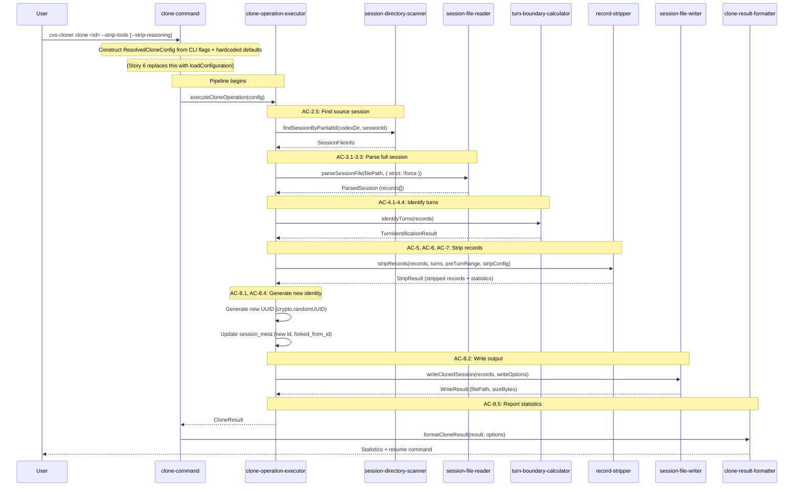

# Story 5: Clone Pipeline and Output

## Objective

After this story ships, a user can run `cxs-cloner clone <sessionId> --strip-tools` and get a cleaned clone of their session written to the Codex sessions directory, resumable via `codex resume <newId>`. The full pipeline orchestrates: find → parse → identify turns → strip → generate new ID → update session_meta → write → report statistics. Custom output paths, `--force` for malformed input, and JSON output are all supported.

## Scope

### In Scope

- Clone pipeline orchestration (`clone-operation-executor`)
- New thread ID generation (UUID v4)
- `session_meta` update: new `id`, `forked_from_id` set to source session's thread ID, original fields preserved
- Session file writer: JSONL output with proper naming (`rollout-<timestamp>-<uuid>.jsonl`), date hierarchy creation, atomic write (temp file + rename)
- Default output path (`~/.codex/sessions/YYYY/MM/DD/`) vs. custom `--output` path
- Resume guarantee logic: display resume command only when written to default location
- Clone statistics: original/clone sizes, reduction %, per-type removal counts
- Human-readable and JSON statistics output
- `cxs-cloner clone` command with all flags (`--strip-tools`, `--strip-reasoning`, `--output`, `--force`, `--json`, `--verbose`, `--codex-dir`)
- CLI validation: at least one stripping flag required
- Arg normalization for boolean/string flags (`normalize-args.ts`)
- `--force` mode: skip malformed JSON lines during clone instead of aborting

### Out of Scope

- Stripping algorithm implementation (Story 4 — already complete)
- Session discovery implementation (Story 1 — already complete)
- Layered c12/zod configuration (Story 6 — clone-command uses hardcoded defaults + CLI flags)
- Compacted session preset calibration (Story 7)

## Dependencies / Prerequisites

- Story 1 must be complete (session directory scanner)
- Story 2 must be complete (full JSONL parser, partial ID lookup)
- Story 3 must be complete (turn boundary calculator)
- Story 4 must be complete (record stripping algorithm)

## Acceptance Criteria

**AC-6.1 (partial — TC-6.1.0 only):** At least one stripping flag is required.

- **TC-6.1.0: No stripping flags returns error**
  - Given: `clone <id>` with neither `--strip-tools` nor `--strip-reasoning`
  - When: Clone is run
  - Then: The command returns an error: "At least one stripping flag is required. Use --strip-tools, --strip-reasoning, or both."

**AC-8.1:** The system SHALL generate a new thread ID for the cloned session.

- **TC-8.1.1: Clone gets new UUID**
  - Given: Any clone operation
  - When: A clone is created
  - Then: The output file has a new UUID that differs from the source
- **TC-8.1.2: session_meta contains new thread ID**
  - Given: Any clone operation
  - When: A clone is created
  - Then: The `session_meta` record in the output contains the new thread ID

**AC-8.2:** The system SHALL write the clone to the correct location with proper naming.

- **TC-8.2.1: Default output path uses date hierarchy**
  - Given: A clone with no `--output` flag
  - When: A clone is created
  - Then: The output file is written to `~/.codex/sessions/YYYY/MM/DD/rollout-<timestamp>-<newId>.jsonl` where the date matches the current date
- **TC-8.2.2: Custom output path honored**
  - Given: `--output /custom/path.jsonl` is specified
  - When: A clone is created
  - Then: The clone is written to the custom path instead

**AC-8.3:** The resume guarantee SHALL apply only when the clone is written to the default Codex sessions directory.

- **TC-8.3.1: Default path clone is resumable (manual validation)**
  - Given: A clone written to the default sessions directory
  - When: `codex resume <newId>` is run
  - Then: The session is discoverable (integration test — manual validation)
- **TC-8.3.2: Custom path clone warns no resume**
  - Given: A clone written to a custom `--output` path
  - When: The clone completes
  - Then: The system does NOT display a resume command and instead warns that the clone will not appear in `codex resume`
- **TC-8.3.3: Every output line is valid JSON**
  - Given: A cloned session file
  - When: Parsed line-by-line
  - Then: Every line is valid JSON

**AC-8.4:** The system SHALL update `session_meta` in the clone.

- **TC-8.4.1: session_meta payload.id matches new UUID**
  - Given: Any clone operation
  - When: A clone is created
  - Then: The `session_meta` record has the new thread ID in `payload.id`
- **TC-8.4.2: session_meta preserves original fields**
  - Given: Any clone operation
  - When: A clone is created
  - Then: The `session_meta` record preserves the original `cwd`, `git`, and `model_provider` fields
- **TC-8.4.3: session_meta sets forked_from_id**
  - Given: Any clone operation
  - When: A clone is created
  - Then: The `session_meta` record sets `forked_from_id` to the source session's thread ID

**AC-8.5:** The system SHALL report statistics after cloning.

- **TC-8.5.1: Statistics include all required counts**
  - Given: A completed clone
  - When: Statistics are displayed
  - Then: The output includes: original size, clone size, size reduction %, records removed by type (tool calls, reasoning, event messages, turn_context, ghost_snapshots), turn counts
- **TC-8.5.2: JSON statistics output**
  - Given: `--json` is specified
  - When: Statistics are output
  - Then: Statistics are output as a JSON object

**AC-10.2:** The system SHALL report compaction status in clone statistics.

- **TC-10.2.1: Compaction detected in statistics**
  - Given: A session with compacted records
  - When: Clone statistics are displayed
  - Then: A `compaction_detected: true` flag and count are included

## Error Paths

| Scenario | Expected Response |
|----------|------------------|
| No stripping flags provided | Error: "At least one stripping flag is required. Use --strip-tools, --strip-reasoning, or both." (exit code 1) |
| Session not found | `SessionNotFoundError` with partial match suggestions (exit code 1) |
| Ambiguous partial ID | `AmbiguousMatchError` listing matches (exit code 1) |
| Malformed JSON without --force | `MalformedJsonError` with line number (exit code 1) |
| Malformed JSON with --force | Warning, bad lines skipped, clone proceeds |
| Session has zero tool calls | Clone proceeds (reasoning/telemetry still stripped), warning emitted |
| Disk full on write | Error, partial temp file cleaned up (exit code 1) |
| Custom output directory doesn't exist | Create parent directories, or error if permissions insufficient |

## Definition of Done

- [ ] All ACs met
- [ ] All TC conditions verified (14 TCs, 1 manual)
- [ ] Full clone pipeline works end-to-end against real Codex sessions
- [ ] `cxs-cloner clone <id> --strip-tools` produces resumable clone
- [ ] Custom output path works with appropriate warning
- [ ] Statistics accurately reflect what was stripped
- [ ] PO accepts

---

## Technical Implementation

### Architecture Context

This story orchestrates the full clone pipeline and implements file output. It brings together all previous stories into the end-to-end `clone` command: session discovery (Story 1), full parsing (Story 2), turn boundary identification (Story 3), and record stripping (Story 4). It adds new modules for pipeline orchestration, file writing, result formatting, and CLI arg validation.

**Important design note:** In this story, the `clone-command` constructs `ResolvedCloneConfig` directly from CLI flags and hardcoded preset defaults, bypassing `configuration-loader`. Story 6 replaces this with the full c12/zod layered configuration pipeline.

**Modules and Responsibilities:**

| Module | Path | Responsibility | AC Coverage |
|--------|------|----------------|-------------|
| `clone-operation-executor` | `src/core/clone-operation-executor.ts` | Orchestrate full pipeline: find → parse → identify turns → strip → generate ID → update session_meta → write → merge statistics | AC-8.1–8.5, AC-10.2 |
| `session-file-writer` | `src/io/session-file-writer.ts` | Write JSONL with proper naming, create date hierarchy, atomic write (temp file + rename) | AC-8.2 |
| `clone-result-formatter` | `src/output/clone-result-formatter.ts` | Format statistics as human-readable or JSON. Display resume command conditionally. | AC-8.5 |
| `clone-command` | `src/commands/clone-command.ts` | Wire citty command for `clone`. Construct `ResolvedCloneConfig` from CLI flags + hardcoded defaults. Invoke executor. Format output. | UF-3, UF-4, UF-5, UF-6, UF-7 |
| `normalize-args` | `src/cli/normalize-args.ts` | Validate at least one stripping flag present; pre-process boolean/string flags | AC-6.1 (TC-6.1.0) |

**Clone Pipeline Flow (from Tech Design §Flow 3 — full sequence):**



**Pipeline Stage Details:**

1. **Find source session:** Uses `findSessionByPartialId` from Story 2. Handles not-found and ambiguous matches with appropriate errors.

2. **Parse full session:** Uses `parseSessionFile` from Story 2. Strict mode by default; `--force` passes `strict: false` to skip malformed lines.

3. **Identify turns:** Uses `identifyTurns` from Story 3. Returns `TurnIdentificationResult` with turns, pre-turn records, and compaction info.

4. **Strip records:** Uses `stripRecords` from Story 4. Passes turns, pre-turn range, and `StripConfig`. Returns `StripResult` with stripped records and partial statistics (per-type removal counts, turn counts, compaction info — but NOT file-size fields).

5. **Generate new identity:** `crypto.randomUUID()` for the new thread ID. Update `session_meta` record: set `payload.id` to new UUID, set `forked_from_id` to source session's thread ID, preserve all other fields (`cwd`, `git`, `model_provider`, etc.).

6. **Write output:** The writer accepts `WriteSessionOptions` (outputPath, codexDir, threadId). When `outputPath` is null, generates default path: `{codexDir}/sessions/YYYY/MM/DD/rollout-<timestamp>-<threadId>.jsonl`. Creates date hierarchy via `mkdir -p`. Writes via atomic temp-file-then-rename pattern. Returns `WriteResult` with `filePath`, `sizeBytes`, and `isDefaultLocation`.

7. **Merge statistics:** Combine `StripResult.statistics` (per-type removal counts) with file-size fields: `originalSizeBytes` from `ParsedSession.fileSizeBytes`, `outputSizeBytes` from `WriteResult.sizeBytes`, `fileSizeReductionPercent` computed from both.

**Resume Guarantee:**

The resume command is displayed only when the clone is written to the default Codex sessions directory (`WriteResult.isDefaultLocation === true`). When `--output` is specified, the clone goes to a custom path and the system warns: "Custom output path — clone will not appear in `codex resume`." No resume command is displayed.

Resumability depends on:
1. Writing to `~/.codex/sessions/YYYY/MM/DD/` hierarchy
2. Using the correct filename convention (`rollout-<timestamp>-<uuid>.jsonl`)
3. Preserving `session_meta` as the first record with updated thread ID
4. Preserving `user_message` event records (via the preserve-list in Story 4)
5. Every output line being valid JSON

**Atomic Write Pattern:**

```
Write to: target.tmp
On success: rename target.tmp → target
On failure: unlink target.tmp
```

JSON re-serialization via `JSON.stringify` per record — field ordering may differ from source (acceptable per JSON specification).

### Interfaces & Contracts

**Creates:**

```typescript
// src/core/clone-operation-executor.ts
import type { ResolvedCloneConfig, CloneResult } from "../types/clone-operation-types.js";

/**
 * Orchestrate the full clone pipeline.
 *
 * Pipeline: find → parse → identify turns → strip → new ID → update meta → write → merge statistics
 */
export async function executeCloneOperation(
  config: ResolvedCloneConfig,
): Promise<CloneResult>;

// src/io/session-file-writer.ts
import type { RolloutLine } from "../types/codex-session-types.js";
import type { WriteSessionOptions, WriteResult } from "../types/clone-operation-types.js";

/**
 * Write cloned session to disk.
 * When outputPath is null: generates path in codexDir/sessions/YYYY/MM/DD/.
 * Creates directories as needed. Atomic write (temp + rename).
 */
export async function writeClonedSession(
  records: RolloutLine[],
  options: WriteSessionOptions,
): Promise<WriteResult>;

// src/output/clone-result-formatter.ts
import type { CloneResult } from "../types/clone-operation-types.js";

/**
 * Format clone result for display.
 * Human-readable or JSON based on options.
 * Shows resume command only when result.resumable is true.
 */
export function formatCloneResult(
  result: CloneResult,
  options: { json: boolean; verbose: boolean },
): string;

// src/commands/clone-command.ts
// citty defineCommand(...) for "clone" subcommand
// Args: <sessionId> (positional)
// Flags: --strip-tools (boolean/string), --strip-reasoning (string),
//        --output (string), --force (boolean), --json (boolean),
//        --verbose (boolean), --codex-dir (string)

// src/cli/normalize-args.ts (addition)
// Validate at least one stripping flag (--strip-tools or --strip-reasoning) present
// Pre-process boolean/string flag handling for citty compatibility
```

**Consumes (from Story 0):**

```typescript
// src/types/clone-operation-types.ts
export interface ResolvedCloneConfig {
  sessionId: string;
  codexDir: string;
  outputPath: string | null;
  stripConfig: StripConfig;
  force: boolean;
  jsonOutput: boolean;
  verbose: boolean;
}

export interface CloneResult {
  operationSucceeded: boolean;
  clonedThreadId: string;
  clonedSessionFilePath: string;
  sourceThreadId: string;
  sourceSessionFilePath: string;
  resumable: boolean;
  statistics: CloneStatistics;
}

export interface CloneStatistics { ... } // All fields

export interface WriteSessionOptions {
  outputPath: string | null;
  codexDir: string;
  threadId: string;
}

export interface WriteResult {
  filePath: string;
  sizeBytes: number;
  isDefaultLocation: boolean;
}

// src/errors/clone-operation-errors.ts
export class ArgumentValidationError extends CxsError { ... }
export class FileOperationError extends CxsError { ... }
```

**Consumes (from Stories 1-4):**

```typescript
// Story 1 — session-directory-scanner
export async function scanSessionDirectory(...): Promise<SessionFileInfo[]>;

// Story 2 — session-directory-scanner (addition) + session-file-reader
export async function findSessionByPartialId(...): Promise<SessionFileInfo>;
export async function parseSessionFile(...): Promise<ParsedSession>;

// Story 3 — turn-boundary-calculator
export function identifyTurns(...): TurnIdentificationResult;

// Story 4 — record-stripper
export function stripRecords(...): StripResult;

// Story 4 — tool-removal-presets
export function resolvePreset(...): ToolRemovalPreset;
```

### TC -> Test Mapping

| TC | Test File | Test Description | Approach |
|----|-----------|------------------|----------|
| TC-6.1.0 | `test/cli/normalize-args.test.ts` | TC-6.1.0: no stripping flags → error | Call normalize-args with argv containing no `--strip-tools` or `--strip-reasoning`. Assert `ArgumentValidationError` with appropriate message. |
| TC-8.1.1 | `test/integration/clone-operation-executor.test.ts` | TC-8.1.1: clone gets new UUID | Execute full clone with temp dir. Assert output file's UUID differs from source UUID. |
| TC-8.1.2 | `test/integration/clone-operation-executor.test.ts` | TC-8.1.2: session_meta has new thread ID | Execute full clone. Parse output, check `session_meta` record. Assert `payload.id` matches new UUID. |
| TC-8.2.1 | `test/io/session-file-writer.test.ts` | TC-8.2.1: default output path is correct date hierarchy | Call `writeClonedSession` with `outputPath: null`. Assert file written to `{codexDir}/sessions/YYYY/MM/DD/rollout-<ts>-<id>.jsonl`. |
| TC-8.2.2 | `test/io/session-file-writer.test.ts` | TC-8.2.2: custom output path is honored | Call `writeClonedSession` with `outputPath: "/tmp/test.jsonl"`. Assert file written to custom path. |
| TC-8.3.1 | Manual validation | Manual: codex resume discovers the clone | After running a full clone to default location, run `codex resume <newId>` and verify session is discoverable. Manual validation — excluded from automated test totals. |
| TC-8.3.2 | `test/integration/clone-operation-executor.test.ts` | TC-8.3.2: custom path warns no resume, no resume command | Execute clone with `outputPath` set. Assert `result.resumable === false`. Assert no resume command in formatted output (tested at executor level — verifies `resumable` flag derivation from `WriteResult.isDefaultLocation`). |
| TC-8.3.3 | `test/integration/clone-operation-executor.test.ts` | TC-8.3.3: every output line is valid JSON | Execute full clone. Read output file. `JSON.parse` every line. Assert no parse errors. |
| TC-8.4.1 | `test/integration/clone-operation-executor.test.ts` | TC-8.4.1: session_meta payload.id matches new UUID | Execute clone. Assert `session_meta.payload.id` equals `result.clonedThreadId`. |
| TC-8.4.2 | `test/integration/clone-operation-executor.test.ts` | TC-8.4.2: session_meta preserves original cwd, git, model_provider | Execute clone with source session containing git info. Assert original `cwd`, `git`, `model_provider` preserved in output `session_meta`. |
| TC-8.4.3 | `test/integration/clone-operation-executor.test.ts` | TC-8.4.3: session_meta sets forked_from_id to source ID | Execute clone. Assert `session_meta.payload.forked_from_id` equals source session's thread ID. |
| TC-8.5.1 | `test/integration/clone-operation-executor.test.ts` | TC-8.5.1: statistics include all required counts | Execute clone with known session. Assert all `CloneStatistics` fields populated: original size, clone size, reduction %, per-type removal counts, turn counts. |
| TC-8.5.2 | `test/output/clone-result-formatter.test.ts` | TC-8.5.2: --json flag produces JSON output | Call `formatCloneResult` with `{ json: true }`. Assert output is valid JSON containing expected fields. |
| TC-10.2.1 | `test/integration/clone-operation-executor.test.ts` | TC-10.2.1: compaction detected in statistics | Execute clone on session with compacted records. Assert `statistics.compactionDetected === true` and `compactedRecordCount > 0`. |

### Non-TC Decided Tests

| Test File | Test Description | Source |
|-----------|------------------|--------|
| `test/integration/clone-operation-executor.test.ts` | Clone of session with zero tool calls (warning emitted, reasoning/telemetry still stripped) | Tech Design §Chunk 5 Non-TC Decided Tests |
| `test/integration/clone-operation-executor.test.ts` | Clone of minimal session (just session_meta + one message) | Tech Design §Chunk 5 Non-TC Decided Tests |
| `test/io/session-file-writer.test.ts` | Partial file cleanup on write failure | Tech Design §Chunk 5 Non-TC Decided Tests |
| `test/integration/clone-operation-executor.test.ts` | Concurrent clone operations (file naming collision avoidance via UUID uniqueness) | Tech Design §Chunk 5 Non-TC Decided Tests |

### Risks & Constraints

- **Atomic write pattern:** The temp-file-then-rename approach assumes the temp file and target file are on the same filesystem (rename is atomic only within a filesystem). If `--output` specifies a path on a different mount, the rename could fail. Fallback: copy + delete.
- **Disk full on write:** If the write fails partway, the temp file must be cleaned up. The writer should wrap the write in try/finally to unlink the temp file on error.
- **JSON re-serialization field ordering:** `JSON.stringify` may produce different field ordering than the source JSONL. This is acceptable per the JSON specification but means byte-for-byte comparison with the source will fail. The output is semantically identical.
- **Statistics merge:** The `StripResult.statistics` from the record-stripper contains per-type removal counts and turn counts. The executor adds file-size fields (`originalSizeBytes`, `outputSizeBytes`, `fileSizeReductionPercent`) computed from `ParsedSession.fileSizeBytes` and `WriteResult.sizeBytes`. These are separate concerns — the stripper doesn't know about file sizes.
- **Clone-command config construction:** This story constructs `ResolvedCloneConfig` from CLI flags + hardcoded defaults. Story 6 replaces this with layered c12/zod configuration. The clone-command's config construction is intentionally simple in this story.

### Spec Deviation

None. Checked against Tech Design: §Flow 3 — full sequence diagram, §High Altitude — Output contracts (error responses, exit codes), §Low Altitude — CloneResult/ResolvedCloneConfig/WriteSessionOptions/WriteResult interfaces, §Low Altitude — Clone Operation Executor entry point (full pipeline doc), §Module Responsibility Matrix (executor, writer, clone-command, normalize-args, formatter rows), §Chunk 5 scope and TC mapping.

## Technical Checklist

- [ ] All TCs have passing tests (13 automated TCs + 1 manual)
- [ ] Non-TC decided tests pass (4 tests)
- [ ] Full pipeline works end-to-end: `bun run src/cli.ts clone <id> --strip-tools`
- [ ] Custom output path works with warning and no resume command
- [ ] Atomic write with temp file cleanup on failure
- [ ] Statistics accurately reflect stripping (merge StripResult + file sizes)
- [ ] TypeScript compiles clean (`bun run typecheck`)
- [ ] Lint/format passes (`bun run format:check && bun run lint`)
- [ ] No regressions on Stories 0-4 (`bun test`)
- [ ] Verification: `bun run verify`
- [ ] Spec deviations documented (if any)
