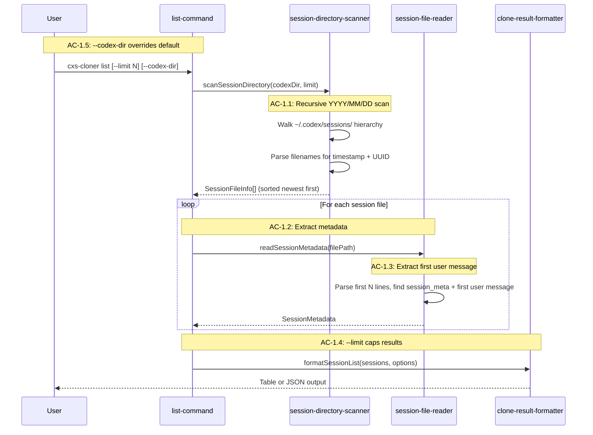
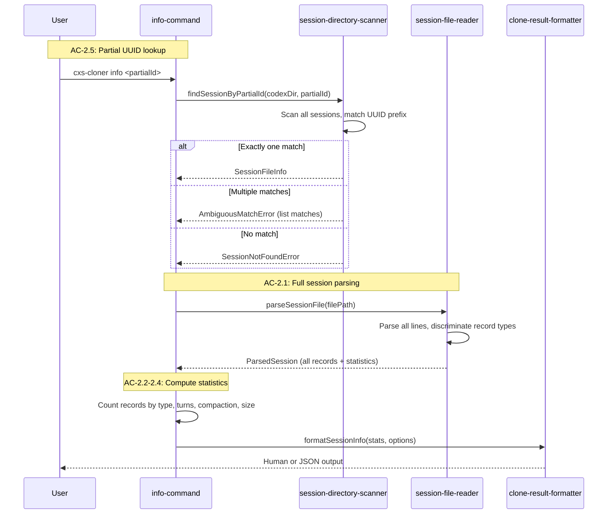
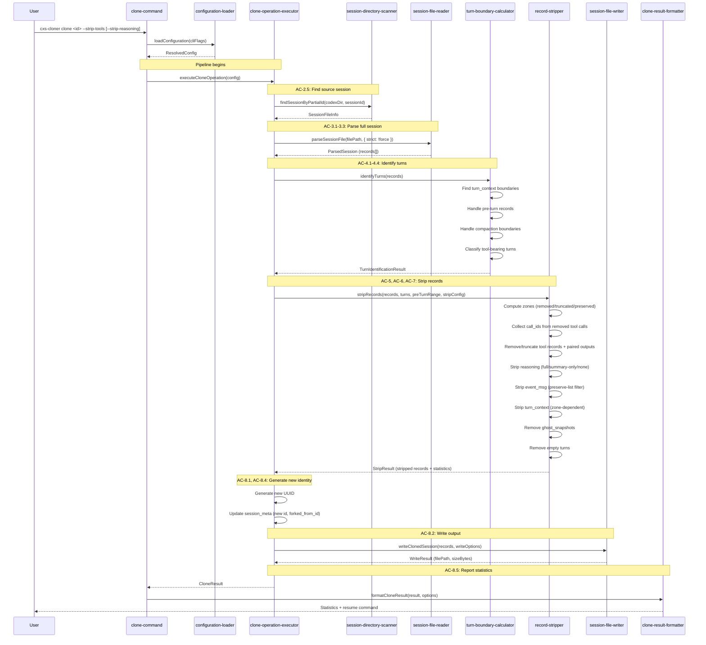

# Technical Design: Codex Session Cloner (cxs-cloner)

## Purpose

This document translates the cxs-cloner epic into implementable architecture. It serves three audiences:

| Audience | Value |
|----------|-------|
| Reviewers | Validate design before code is written |
| Developers | Clear blueprint for implementation |
| Story Tech Sections | Source of implementation targets, interfaces, and test mappings |

**Prerequisite:** The epic is complete (all ACs have TCs). Validated below.

**Structure:** Single document. The feature scope is moderate — a CLI tool with well-understood patterns from ccs-cloner. The complexity lives in the record stripping algorithm and type system, not in sprawling architecture. One document keeps the connections tight.

---

## Spec Validation

Before designing, I validated the epic as downstream consumer — can I map every AC to implementation? Are data contracts complete?

**Validation Checklist:**
- [x] Every AC maps to clear implementation work
- [x] Data contracts are complete and realistic
- [x] Edge cases have TCs, not just happy path
- [x] Flows make sense from implementation perspective
- [x] No blocking technical constraints missed

**Issues Found:**

| # | Issue | Spec Location | Severity | Recommendation | Status |
|---|-------|---------------|----------|----------------|--------|
| V1 | Resume/display reconstruction depends on persisted `event_msg` replay history, not only `response_item` messages | AC-7.1, AC-8.3.1 | Major | Align the default event floor with Codex's native limited persisted-event policy. `user_message` alone is insufficient for visible history replay. | Resolved |
| V2 | EventMsg wire names: canonical v1 names are `task_started`/`task_complete`, not `turn_started`/`turn_complete` | AC-7.1, tech overview | Minor | The epic's preserve-list doesn't include these (they're stripped), so functionality is unaffected. Types should use canonical v1 names with aliases. The `turn_started` alias accepted by the deserializer means either name works in input parsing. | Resolved |
| V3 | TurnContext missing fields: `summary` (ReasoningSummaryConfig, NOT optional in source), `current_date`, `timezone`, `network` | Data Contracts — TurnContextPayload | Minor | These aren't strip targets so omission doesn't break stripping logic. But the type should include them for completeness — use index signature for unknown fields to stay forward-compatible. | Resolved |
| V4 | `instructions` field in TurnContext: epic lists as strip target but not present in Codex Rust source | AC-7.2, TurnContextPayload | Minor | May exist in older session formats or be a mistake. Include it defensively as an optional strip target — if present, strip it; if absent, no harm. Real sessions will confirm. | Resolved |
| V5 | `FunctionCallOutputPayload` shared type: Codex source uses same type for both `function_call_output.output` and `custom_tool_call_output.output` | Data Contracts | Informational | Design truncation logic as shared utility operating on the union type `string \| ContentItem[]`. Avoids duplication. Truncation applies to both `function_call_output` and `custom_tool_call_output` — the shared utility covers both. | Resolved |

No blocking issues. The epic is solid. All issues are minor/informational and addressed in this design.

**Tech Design Questions from Epic:** None explicitly listed. The epic's "Open Questions / Future Work" section covers preset calibration (deferred to Story 7) and percentage-based stripping mode (out of scope). Both are appropriate deferrals.

---

## Context

This tool solves a specific pain point for developers using OpenAI's Codex CLI: context window exhaustion during long coding sessions. Codex sessions accumulate tool call records, reasoning blocks, telemetry events, and repeated instruction payloads in `turn_context` records. A session that started with 128K tokens of capacity gradually fills with machinery that doesn't serve the ongoing conversation. The user wants to extract the conversational signal, discard the machinery, and resume from a cleaned copy.

The existing landscape offers no middle ground. `codex fork` copies everything — same context pressure. Codex's native compaction summarizes everything — losing the conversational detail the user values. cxs-cloner creates the missing middle: deterministic, configurable stripping that preserves conversational content while removing tool execution records, reasoning blocks, and telemetry.

The architecture is deliberately modeled on ccs-cloner, a production tool solving the identical problem for Claude Code sessions. The proven patterns — zone-based stripping, preset system, three-command CLI, c12/zod configuration — transfer directly. But Codex's JSONL format differs from Claude Code's in ways that simplify some operations and complicate others. The key simplification: Codex uses record-level granularity (entire JSONL lines are tool calls, not content blocks nested inside conversation entries), so stripping means dropping lines rather than performing content-block surgery. The key complications: four distinct tool-call types with different pairing behaviors, JSON-in-JSON for `function_call.arguments`, untagged union types for tool outputs, and massive `turn_context` records that repeat full AGENTS.md content every turn.

The tech stack mirrors ccs-cloner exactly — citty for CLI, c12/zod for configuration, Bun for build/test, Biome for formatting/linting. This consistency serves the developer (same patterns across tools) and reduces cognitive overhead for maintenance.

---

## High Altitude: System View

### System Context

cxs-cloner is a local CLI tool. It reads from and writes to the local filesystem. There are no network calls, no databases, no external services. The system boundary is simple: the tool reads Codex session files, transforms them, and writes new session files.

```
┌──────────────────────────────────────────────────────┐
│                    User's Machine                    │
│                                                      │
│   ┌──────────┐     ┌─────────────┐     ┌──────────┐ │
│   │ Terminal  │────▶│ cxs-cloner  │────▶│ Terminal  │ │
│   │ (input)   │     │   CLI       │     │ (output)  │ │
│   └──────────┘     └──────┬──────┘     └──────────┘ │
│                           │                          │
│                    ┌──────┴──────┐                    │
│                    │  Filesystem │                    │
│                    │             │                    │
│          ┌────────┴────────────┐                     │
│          │ ~/.codex/sessions/  │                     │
│          │  YYYY/MM/DD/        │                     │
│          │   rollout-*.jsonl   │                     │
│          └─────────────────────┘                     │
│                                                      │
└──────────────────────────────────────────────────────┘
```

The tool interacts with one external system indirectly: Codex CLI. The cloned session files must be compatible with `codex resume`. This compatibility is maintained by:
1. Writing to the correct directory hierarchy (`~/.codex/sessions/YYYY/MM/DD/`)
2. Using the correct filename convention (`rollout-<timestamp>-<uuid>.jsonl`)
3. Preserving `session_meta` as the first record with updated thread ID
4. Preserving `user_message` event records (required for resume discovery)
5. Producing valid JSONL (one JSON object per line)

### External Contracts

**Input: Codex JSONL Session Files**

Each line is a self-contained JSON object with three top-level fields:

```json
{ "timestamp": "2026-02-28T14:30:00.000Z", "type": "session_meta", "payload": { ... } }
```

The `type` field discriminates five record types. The `payload` field contains type-specific content. For `response_item` and `event_msg` records, the payload itself contains a nested `type` discriminator — a two-level tagging pattern inherited from Rust's serde configuration.

| Record Type | Purpose | Strippable? | AC Coverage |
|-------------|---------|-------------|-------------|
| `session_meta` | Session initialization | No — required for resume | AC-1.2, AC-8.4 |
| `response_item` | Conversation content (10+ subtypes) | Depends on subtype | AC-3.2, AC-5, AC-6 |
| `turn_context` | Per-turn configuration snapshot | Yes — high-volume telemetry | AC-4.1, AC-7.2 |
| `event_msg` | UI/logging stream events | Yes — most are telemetry | AC-7.1 |
| `compacted` | History summarization | No — preserve always | AC-10.1 |

The full type definitions appear in Low Altitude (Interface Definitions). The data contracts from the epic are validated against the Codex Rust source (`codex-rs/protocol/src/protocol.rs`, `codex-rs/protocol/src/models.rs`) and are accurate with the minor additions noted in Spec Validation.

**Output: Cloned JSONL Session Files**

Same format as input. The clone is a valid Codex session file with:
- New thread ID (UUID v4) in filename and `session_meta`
- `forked_from_id` set to source session's thread ID
- Stripped records removed/truncated per configuration
- Current date used for output directory hierarchy

**Output: Clone Statistics (stdout)**

Human-readable summary or JSON (with `--json` flag). Shape defined by `CloneStatistics` interface (see Low Altitude). Statistics include original/clone sizes, reduction percentage, and per-type removal counts.

**Error Responses:**

| Condition | Exit Code | Output | Reference |
|-----------|-----------|--------|-----------|
| Session not found | 1 | Error + partial match suggestions | AC-2.5 |
| Ambiguous partial ID | 1 | Error + matching session list | AC-2.5, TC-2.5.2 |
| No stripping flags | 1 | Error: "At least one stripping flag required" | AC-6.1, TC-6.1.0 |
| Malformed JSON (clone, no --force) | 1 | Error + line number | AC-3.3, TC-3.3.2 |
| Malformed JSON (list/info) | 0 | Warning, continue | AC-3.3, TC-3.3.1 |
| Disk full on write | 1 | Error, partial file cleaned up | AC-8.2 |

**Runtime Prerequisites:**

| Prerequisite | Where Needed | How to Verify |
|---|---|---|
| Bun v1.1+ or Node.js 18+ | Local + CI | `bun --version` or `node --version` |
| `~/.codex/sessions/` directory | Runtime (list/info/clone) | Tool checks and reports error if missing |

---

## Medium Altitude: Module Boundaries

### Module Architecture

The source layout follows ccs-cloner's established pattern, adapted for Codex's record-level format. Each directory groups modules by concern, and the naming reflects what changed: `tool-call-remover` becomes `record-stripper` because we're operating on whole JSONL records rather than content blocks within entries.

```
src/
├── cli.ts                              # Shebang entrypoint, delegates to normalize-args
├── index.ts                            # SDK barrel exports
├── cli/
│   └── normalize-args.ts               # Pre-citty arg preprocessing
├── commands/
│   ├── main-command.ts                 # Root citty command with subcommands
│   ├── clone-command.ts                # Clone session command
│   ├── list-command.ts                 # List sessions command
│   └── info-command.ts                 # Session details command
├── config/
│   ├── configuration-loader.ts         # c12 config loading + env + CLI merge
│   ├── configuration-schema.ts         # Zod schemas for config validation
│   ├── default-configuration.ts        # Built-in defaults
│   └── tool-removal-presets.ts         # Preset definitions + resolution
├── core/
│   ├── clone-operation-executor.ts     # Pipeline orchestrator
│   ├── record-stripper.ts             # Zone-based record stripping (THE core module)
│   └── turn-boundary-calculator.ts     # Turn identification from turn_context records
├── errors/
│   └── clone-operation-errors.ts       # Custom error classes
├── io/
│   ├── session-directory-scanner.ts    # Find sessions in ~/.codex/sessions/
│   ├── session-file-reader.ts          # JSONL parsing + metadata extraction
│   └── session-file-writer.ts          # Write JSONL with proper naming
├── output/
│   ├── clone-result-formatter.ts       # Human/JSON output formatting
│   └── configured-logger.ts            # consola logging setup
└── types/
    ├── index.ts                        # Type barrel exports
    ├── codex-session-types.ts          # JSONL record type definitions
    ├── clone-operation-types.ts        # Clone pipeline types
    ├── tool-removal-types.ts           # Preset and stripping types
    └── configuration-types.ts          # Config schema types
```

Test structure mirrors source, with fixtures separate:

```
test/
├── fixtures/
│   ├── builders/
│   │   └── session-builder.ts          # Programmatic session construction
│   ├── data/
│   │   ├── basic-session.jsonl         # Minimal valid session
│   │   ├── compacted-session.jsonl     # Session with compaction records
│   │   └── malformed-session.jsonl     # Lines with bad JSON
│   └── index.ts                        # Fixture exports + helpers
├── core/
│   ├── record-stripper.test.ts         # Zone algorithm, pairing, truncation
│   └── turn-boundary-calculator.test.ts # Turn detection, compaction boundaries
├── io/
│   ├── session-directory-scanner.test.ts
│   ├── session-file-reader.test.ts
│   └── session-file-writer.test.ts
├── output/
│   └── clone-result-formatter.test.ts  # Human/JSON output formatting
├── config/
│   ├── tool-removal-presets.test.ts
│   └── configuration-loader.test.ts    # c12 config loading, env vars, CLI flag merge
├── cli/
│   └── normalize-args.test.ts
└── integration/
    └── clone-operation-executor.test.ts # Full pipeline with temp directories
```

### Module Responsibility Matrix

| Module | Type | Responsibility | Dependencies | ACs Covered |
|--------|------|----------------|--------------|-------------|
| `session-directory-scanner` | IO | Scan `~/.codex/sessions/` hierarchy, find JSONL files, extract metadata from filenames | `fs/promises`, `pathe` | AC-1.1, AC-1.4, AC-1.5, AC-2.5 |
| `session-file-reader` | IO | Parse JSONL, extract record types, compute statistics, handle malformed lines | `fs/promises` | AC-1.2, AC-1.3, AC-2.1, AC-2.2, AC-2.3, AC-2.4, AC-3.1, AC-3.2, AC-3.3 |
| `session-file-writer` | IO | Write JSONL with proper naming, create date hierarchy, atomic write | `fs/promises`, `pathe` | AC-8.1, AC-8.2 |
| `turn-boundary-calculator` | Core | Identify turn boundaries from `turn_context` records, handle pre-turn records and compaction | types | AC-4.1, AC-4.2, AC-4.3, AC-4.4 |
| `record-stripper` | Core | Zone-based stripping: tool calls, reasoning, telemetry, turn_context, ghost_snapshots | types, turn boundaries | AC-5.1–5.5, AC-6.1–6.2, AC-7.1–7.3, AC-10.1, AC-10.3 |
| `clone-operation-executor` | Core | Orchestrate full clone pipeline: read → parse → identify turns → strip → generate ID → write | all IO, core, config | AC-8.1–8.5, AC-10.2 |
| `tool-removal-presets` | Config | Define/resolve presets, merge custom presets | types | AC-5.4, AC-9.2 |
| `configuration-loader` | Config | Load c12 config, merge env vars, merge CLI flags | c12, zod | AC-9.1, AC-9.3 |
| `clone-command` | Command | Wire clone CLI: arg parsing, config loading, executor invocation, output | executor, config, formatter | UF-3, UF-4, UF-5, UF-6 |
| `list-command` | Command | Wire list CLI: arg parsing, scanner invocation, output | scanner, reader, formatter | UF-1 |
| `info-command` | Command | Wire info CLI: arg parsing, reader invocation, statistics output | scanner, reader, formatter | UF-2 |
| `normalize-args` | CLI | Pre-process argv for citty boolean/string flag handling | none | (supports all commands) |
| `clone-result-formatter` | Output | Format statistics as human-readable or JSON | types, consola | AC-8.5 |

The module with the most TC coverage is `record-stripper` — it handles AC-5 through AC-7 plus parts of AC-10. This is the algorithmic core, equivalent to ccs-cloner's `tool-call-remover.ts`. Expect the test file for this module to be the largest (~800-1000 lines).

### Component Interaction Diagram

The runtime flow for the clone command (the primary operation) shows how modules connect:

```
CLI Input
    │
    ▼
normalize-args ──▶ citty (clone-command)
                        │
                        ▼
                   configuration-loader
                   (c12 + zod + env + flags)
                        │
                        ▼
                clone-operation-executor
                   │         │         │
                   ▼         ▼         ▼
         scanner  reader  writer
         (find)   (parse)  (output)
                   │
                   ▼
         turn-boundary-calculator
                   │
                   ▼
            record-stripper
            (zone assignment,
             tool pairing,
             truncation,
             reasoning/telemetry/
             context stripping)
```

For list and info commands, the flow is simpler — scanner → reader → formatter, without the core stripping pipeline.

**Note:** This diagram shows the final architecture. In Chunk 5, the clone-command constructs `ResolvedCloneConfig` directly from CLI flags and hardcoded preset defaults, bypassing `configuration-loader`. Chunk 6 replaces this with the full c12/zod layered configuration.

---

## Medium Altitude: Flow-by-Flow Design

### Flow 1: List Sessions (UF-1)

**Covers:** AC-1.1 through AC-1.5

The list flow is the simplest entry point. The user wants to see available sessions sorted by recency. The scanner walks the date hierarchy in reverse order, the reader extracts lightweight metadata from each file (just the `session_meta` record and first user message — not full parsing), and the formatter outputs the table.



**Skeleton Requirements:**

| What | Where | Stub Signature |
|------|-------|----------------|
| Scanner | `src/io/session-directory-scanner.ts` | `export async function scanSessionDirectory(codexDir: string, options?: ScanOptions): Promise<SessionFileInfo[]> { throw new NotImplementedError("scanSessionDirectory"); }` |
| Reader (metadata) | `src/io/session-file-reader.ts` | `export async function readSessionMetadata(filePath: string): Promise<SessionMetadata> { throw new NotImplementedError("readSessionMetadata"); }` |
| List command | `src/commands/list-command.ts` | citty `defineCommand(...)` |

**TC Mapping for this Flow:**

| TC | Tests | Module | Setup | Assert |
|----|-------|--------|-------|--------|
| TC-1.1.1 | Two files in one date dir → both returned | `scanner` | Create temp dir with 2 JSONL files | Returns 2 entries |
| TC-1.1.2 | Multiple date dirs → sorted newest first | `scanner` | Files across `2026/01/15/` and `2026/02/28/` | First result is from `02/28` |
| TC-1.1.3 | Empty sessions dir → empty result, no error | `scanner` | Empty temp dir | Returns `[]` |
| TC-1.2.1 | Filename parsing → timestamp + UUID extracted | `scanner` | File named `rollout-2026-02-28T14-30-00-<uuid>.jsonl` | `created_at` and `thread_id` match |
| TC-1.2.2 | session_meta record → metadata fields accessible | `reader` | JSONL with session_meta record | `cwd`, `model_provider`, `cli_version`, `git` all present |
| TC-1.3.1 | First user message (response_item) → truncated text | `reader` | Session with user message response_item | Text truncated to 80 chars |
| TC-1.3.2 | First user message (event_msg fallback) → uses event text | `reader` | Session without user response_item, with user_message event | Event message text used |
| TC-1.4.1 | --limit 10 on 50 sessions → returns 10 | `scanner` | 50 files | Returns 10 (newest) |
| TC-1.5.1 | --codex-dir override → scans custom path | `scanner` | Custom dir structure | Scans from custom path |

---

### Flow 2: Inspect Session (UF-2)

**Covers:** AC-2.1 through AC-2.5

The info flow performs full parsing of a single session file. It counts records by type, identifies compaction records, counts turns, and reports file size with estimated token count. The partial UUID matching (AC-2.5) is the first piece of session lookup that the clone command also uses.



**Skeleton Requirements:**

| What | Where | Stub Signature |
|------|-------|----------------|
| Partial ID lookup | `src/io/session-directory-scanner.ts` | `export async function findSessionByPartialId(codexDir: string, partialId: string): Promise<SessionFileInfo> { throw new NotImplementedError("findSessionByPartialId"); }` |
| Full parser | `src/io/session-file-reader.ts` | `export async function parseSessionFile(filePath: string, options?: ParseOptions): Promise<ParsedSession> { throw new NotImplementedError("parseSessionFile"); }` |
| Info command | `src/commands/info-command.ts` | citty `defineCommand(...)` |

**TC Mapping for this Flow:**

| TC | Tests | Module | Setup | Assert |
|----|-------|--------|-------|--------|
| TC-2.1.1 | 10 function_call records → count reported | `reader` | Session JSONL with function_calls | `function_calls: 10` |
| TC-2.1.2 | 3 reasoning records → count reported | `reader` | Session with reasoning items | `reasoning_blocks: 3` |
| TC-2.1.3 | 50 event_msg records → count reported | `reader` | Session with events | `event_messages: 50` |
| TC-2.2.1 | 2 compacted records → positions reported | `reader` | Session with compacted records | `compacted_records: 2` with line positions |
| TC-2.2.2 | 0 compacted records → none reported | `reader` | Session without compaction | `compacted: none` |
| TC-2.3.1 | 5 turn_context records → turns: 5 | `reader` | Session with turn_context records | `turns: 5` |
| TC-2.4.1 | 100KB file → size + token estimate | `reader` | Known-size file | `~98 KB`, `~25,000 tokens` |
| TC-2.5.1 | Partial UUID prefix → session found | `scanner` | Session with known UUID | Found by prefix |
| TC-2.5.2 | Ambiguous partial ID → error with matches | `scanner` | Two sessions with shared prefix | Error listing both |

---

### Flow 3: Clone with Stripping (UF-3 — the core flow)

**Covers:** AC-3.3, AC-4 (via turn boundaries), AC-5, AC-6, AC-7, AC-8, AC-10

This is the primary flow and the most complex. The clone pipeline orchestrates seven stages: session lookup, full parsing, turn boundary identification, record stripping, new ID generation, output writing, and statistics reporting. Understanding this flow is understanding the tool.

The pipeline is orchestrated by `clone-operation-executor`, which coordinates the other modules. The executor doesn't contain stripping logic — it delegates to `turn-boundary-calculator` and `record-stripper`. This separation keeps each module testable in isolation while the executor tests verify the full assembly.



**The Zone Model (AC-5.1) — the core algorithm:**

The stripping algorithm operates on tool-bearing turns (turns containing at least one tool call record). Non-tool-bearing turns pass through unchanged. The algorithm assigns each tool-bearing turn to one of three zones:

```
Tool-bearing turns (chronological order):
┌──────────┬──────────────┬────────────────┐
│ REMOVED  │  TRUNCATED   │   PRESERVED    │
│ (oldest) │  (middle)    │   (newest)     │
│          │              │                │
│ Drop all │ Keep calls,  │ Keep everything│
│ tool     │ truncate     │ at full        │
│ records  │ output       │ fidelity       │
│          │ content      │                │
└──────────┴──────────────┴────────────────┘
          ◀─────── keepTurnsWithTools ──────▶
                   ◀─ truncate% ─▶
```

Zone calculation from preset parameters:
- `keepTurnsWithTools`: how many tool-bearing turns to retain (from the end)
- `truncatePercent`: what fraction of retained turns get truncated (from the older end of retained)
- Turns beyond `keepTurnsWithTools` (counted from newest) → **removed zone**
- Of retained turns, `Math.floor(truncatePercent / 100 * kept)` oldest → **truncated zone**
- Remaining retained turns → **preserved zone**

Example with 30 tool-bearing turns, `default` preset (keep=20, truncate=50%):
- 10 oldest → removed (30 - 20 = 10)
- 10 middle → truncated (floor(50% × 20) = 10)
- 10 newest → preserved (20 - 10 = 10)

**Skeleton Requirements:**

| What | Where | Stub Signature |
|------|-------|----------------|
| Turn calculator | `src/core/turn-boundary-calculator.ts` | `export function identifyTurns(records: RolloutLine[]): TurnIdentificationResult { throw new NotImplementedError("identifyTurns"); }` |
| Record stripper | `src/core/record-stripper.ts` | `export function stripRecords(records: RolloutLine[], turns: TurnInfo[], preTurnRange: { startIndex: number; endIndex: number }, config: StripConfig): StripResult { throw new NotImplementedError("stripRecords"); }` |
| Clone executor | `src/core/clone-operation-executor.ts` | `export async function executeCloneOperation(config: ResolvedCloneConfig): Promise<CloneResult> { throw new NotImplementedError("executeCloneOperation"); }` |
| Session writer | `src/io/session-file-writer.ts` | `export async function writeClonedSession(records: RolloutLine[], options: WriteSessionOptions): Promise<WriteResult> { throw new NotImplementedError("writeClonedSession"); }` |
| Clone command | `src/commands/clone-command.ts` | citty `defineCommand(...)` |

**TC Mapping for this Flow:**

This flow covers the most TCs. They're organized by sub-algorithm:

*Turn Boundary Identification (AC-4):*

| TC | Tests | Module | Setup | Assert |
|----|-------|--------|-------|--------|
| TC-4.1.1 | 3 turn_context records → 3 turns with correct boundaries | `turn-boundary-calculator` | Records with turn_context at positions 5, 20, 40 | Boundaries [5, 20), [20, 40), [40, N) using exclusive endIndex |
| TC-4.1.2 | event_msg between turn_contexts → bounded by turn_context | `turn-boundary-calculator` | user_message event between turn_contexts | Turns bounded by turn_context, not events |
| TC-4.2.1 | Pre-turn records (before first turn_context) → preserved, not in any turn | `turn-boundary-calculator` | session_meta + response_items before first turn_context | Pre-turn records flagged separately |
| TC-4.3.1 | Compacted record → only post-compaction turns identified | `turn-boundary-calculator` | Compacted at line 10, 5 turn_contexts after | 5 turns identified, pre-compaction records are pre-turn |
| TC-4.3.2 | Mid-turn compaction → post-compaction turn_context defines boundary | `turn-boundary-calculator` | turn_context, then compaction, then turn_context | Only post-compaction turn_context defines turns |
| TC-4.4.1 | Turn with function_call/function_call_output → tool-bearing | `turn-boundary-calculator` | Turn containing function_call records | `isToolBearing: true` |
| TC-4.4.2 | Turn with only message/reasoning → not tool-bearing | `turn-boundary-calculator` | Turn with message and reasoning only | `isToolBearing: false` |
| TC-4.4.3 | Turn with local_shell_call/custom_tool_call/web_search_call → tool-bearing | `turn-boundary-calculator` | Turn with each tool type | `isToolBearing: true` for each |

*Zone-Based Tool Stripping (AC-5):*

| TC | Tests | Module | Setup | Assert |
|----|-------|--------|-------|--------|
| TC-5.1.1 | 30 tool turns, default preset → 10 removed, 10 truncated, 10 preserved | `record-stripper` | 30 tool-bearing turns | Zone counts match |
| TC-5.1.2 | 5 tool turns, default preset → all preserved (5 < 20) | `record-stripper` | 5 tool-bearing turns | 0 removed, all preserved |
| TC-5.2.1 | Removed function_call → matching function_call_output also removed | `record-stripper` | function_call + output with same call_id in removed zone | Both removed |
| TC-5.2.2 | Removed custom_tool_call → matching output also removed | `record-stripper` | custom_tool_call + output with same call_id in removed zone | Both removed |
| TC-5.2.3 | Removed local_shell_call → removed (standalone) | `record-stripper` | local_shell_call in removed zone | Record removed |
| TC-5.2.4 | Removed web_search_call → removed (standalone) | `record-stripper` | web_search_call in removed zone | Record removed |
| TC-5.3.1 | Truncated function_call_output (string) → truncated to 120 chars | `record-stripper` | 5000-char output string in truncated zone | Output ≤ 123 chars (120 + "...") |
| TC-5.3.2 | Truncated function_call_output (ContentItem[]) → text items truncated | `record-stripper` | ContentItem array output in truncated zone | Text within items truncated |
| TC-5.3.3 | Truncated function_call arguments (JSON-in-JSON) → string values truncated | `record-stripper` | Large arguments JSON string in truncated zone | Parsed, truncated, re-serialized |
| TC-5.4.1 | --strip-tools (no value) → default preset (keep=20, truncate=50%) | `presets` | Flag without value | Resolves to default |
| TC-5.4.2 | --strip-tools=extreme → keep=0 | `presets` | extreme preset | All tool calls removed |
| TC-5.4.3 | --strip-tools=heavy → keep=10, truncate=80% | `presets` | heavy preset | Correct values |
| TC-5.5.1 | Removed turn with only tool records → entire turn removed | `record-stripper` | Turn with only function_call + output, no messages | Turn + turn_context + events removed |
| TC-5.5.2 | Removed turn with tools AND messages → tools removed, messages kept | `record-stripper` | Turn with function_call + message records | Tool records removed, message preserved |

*Reasoning Stripping (AC-6):*

| TC | Tests | Module | Setup | Assert |
|----|-------|--------|-------|--------|
| TC-6.1.0 | No stripping flags → error | `normalize-args` | No --strip-tools or --strip-reasoning | Error returned |
| TC-6.1.1 | --strip-tools without --strip-reasoning → reasoning removed (default=full) | `record-stripper` | Tools + reasoning records, only --strip-tools | Reasoning records absent |
| TC-6.1.2 | --strip-tools --strip-reasoning=none → reasoning preserved | `record-stripper` | Both flags, reasoning=none | Reasoning records present |
| TC-6.1.3 | --strip-reasoning=full without --strip-tools → reasoning removed, tools and telemetry preserved | `record-stripper` | Only --strip-reasoning=full | Reasoning gone, tools present, event_msg records preserved (telemetry stripping NOT active without --strip-tools) |
| TC-6.1.4 | --strip-reasoning=summary-only → keep summary, drop content | `record-stripper` | Reasoning record with summary + encrypted_content | `summary` present, `encrypted_content` absent |
| TC-6.2.1 | reasoning response_item → removed when full strip active | `record-stripper` | Reasoning record | Record removed |
| TC-6.2.2 | compaction response_item → preserved (not reasoning) | `record-stripper` | Compaction subtype record | Record preserved |

*Telemetry and Context Stripping (AC-7):*

| TC | Tests | Module | Setup | Assert |
|----|-------|--------|-------|--------|
| TC-7.1.1 | exec_command_* events → removed when active | `record-stripper` | Event records with exec subtypes | Records removed |
| TC-7.1.2 | Native replay events → preserved | `record-stripper` | user_message, agent_message, turn_started, turn_complete, context_compacted | Records present |
| TC-7.1.3 | item_completed(plan) → preserved, other item_completed → removed | `record-stripper` | item_completed with plan and non-plan payloads | Only plan preserved |
| TC-7.1.4 | Non-native non-configured events → removed | `record-stripper` | agent_message_delta, exec_command_begin | Records removed |
| TC-7.2.1 | turn_context in removed zone → removed | `record-stripper` | turn_context in removed zone | Record absent |
| TC-7.2.2 | turn_context in truncated zone → removed | `record-stripper` | turn_context in truncated zone | Record absent |
| TC-7.2.3 | turn_context in preserved zone → kept, instructions stripped | `record-stripper` | turn_context with user_instructions etc. | Structural fields present, instruction fields absent |
| TC-7.3.1 | ghost_snapshot records → removed | `record-stripper` | ghost_snapshot response_item | Record removed |

*Clone Output (AC-8):*

| TC | Tests | Module | Setup | Assert |
|----|-------|--------|-------|--------|
| TC-8.1.1 | Clone gets new UUID | `executor` | Any clone | Output UUID ≠ source UUID |
| TC-8.1.2 | session_meta in output has new thread ID | `executor` | Any clone | session_meta.payload.id = new UUID |
| TC-8.2.1 | Default output path → correct date hierarchy | `writer` | Clone with no --output | Path = `~/.codex/sessions/YYYY/MM/DD/rollout-<ts>-<id>.jsonl` |
| TC-8.2.2 | Custom --output → writes to custom path | `writer` | Clone with --output /tmp/x.jsonl | File at /tmp/x.jsonl |
| TC-8.3.1 | Default path clone → resumable (manual validation) | *integration* | Full clone | `codex resume <id>` finds it |
| TC-8.3.2 | Custom path clone → no resume command, warning | `executor` | Clone with --output | Warning emitted, no resume cmd |
| TC-8.3.3 | Every output line → valid JSON | `executor` | Any clone | JSON.parse succeeds for every line |
| TC-8.4.1 | session_meta → new thread ID in payload.id | `executor` | Any clone | Matches generated UUID |
| TC-8.4.2 | session_meta → preserves original cwd, git, model_provider | `executor` | Clone of session with git info | Original fields preserved |
| TC-8.4.3 | session_meta → forked_from_id set to source ID | `executor` | Any clone | `forked_from_id` = source thread ID |
| TC-8.5.1 | Statistics include all counts | `executor` | Clone operation | All fields in CloneStatistics populated |
| TC-8.5.2 | --json flag → JSON statistics output | `formatter` | Clone with --json | Valid JSON with expected fields |

*Compacted Session Handling (AC-10):*

| TC | Tests | Module | Setup | Assert |
|----|-------|--------|-------|--------|
| TC-10.1.1 | Top-level compacted record → preserved in output | `record-stripper` | Session with compacted record | Record in output unchanged |
| TC-10.1.2 | Compaction response_item → preserved in output | `record-stripper` | Session with compaction subtype | Record in output unchanged |
| TC-10.2.1 | Compacted session → statistics report compaction | `executor` | Session with compacted records | `compactionDetected: true`, count present |
| TC-10.3.1 | Compacted + 15 post-compaction tool turns, keep=20 → all preserved | `record-stripper` | Compacted session, 15 tool turns | 0 removed (15 < 20) |
| TC-10.3.2 | Compacted + 40 post-compaction tool turns, default → zones applied correctly | `record-stripper` | Compacted session, 40 tool turns | 20 removed, 10 truncated, 10 preserved |

*JSONL Parsing (AC-3):*

| TC | Tests | Module | Setup | Assert |
|----|-------|--------|-------|--------|
| TC-3.1.1 | session_meta record → fields accessible | `reader` | session_meta JSON line | id, cwd, cli_version accessible |
| TC-3.1.2 | function_call response_item → fields accessible | `reader` | function_call JSON line | name, arguments, call_id accessible |
| TC-3.1.3 | reasoning response_item → fields accessible | `reader` | reasoning JSON line | summary, encrypted_content accessible |
| TC-3.1.4 | Unknown record/subtype → preserved as-is with debug log | `reader` | Unknown type JSON line | Record preserved, debug-level log emitted |
| TC-3.2.1 | All response_item subtypes → correctly identified | `reader` | One line per subtype | Each subtype correctly discriminated |
| TC-3.3.1 | Malformed JSON in list/info → skip with warning | `reader` | JSONL with bad line | Bad line skipped, warning emitted, others processed |
| TC-3.3.2 | Malformed JSON in clone → abort with line number | `reader` | JSONL with bad line, strict mode | Error with line number |
| TC-3.3.3 | Malformed JSON in clone --force → skip with warning | `reader` | JSONL with bad line, force mode | Bad line skipped, warning emitted |

*Configuration (AC-9):*

| TC | Tests | Module | Setup | Assert |
|----|-------|--------|-------|--------|
| TC-9.1.1 | Env var CXS_CLONER_CODEX_DIR → used as codex dir | `config-loader` | Set env var, no CLI flag | Custom path used |
| TC-9.1.2 | Env var + CLI flag → CLI flag wins | `config-loader` | Both set | CLI flag value used |
| TC-9.2.1 | Custom preset in config → applied when named | `presets` | Config with custom preset | Custom values applied |
| TC-9.2.2 | defaultPreset in config → used when no preset named | `presets` | Config with defaultPreset | Configured default applied |
| TC-9.3.1 | eventPreserveList in config → augments built-in list | `record-stripper` | Config with extra preserved events | Extra events preserved |

---

## Low Altitude: Interface Definitions

These types are copy-paste ready for Chunk 0. They form the vocabulary of the entire implementation — every module references them.

### Codex Session Types (`src/types/codex-session-types.ts`)

The foundational record types, derived from the epic's data contracts and validated against the Codex Rust source.

```typescript
/**
 * Universal JSONL record envelope.
 * Every line in a Codex session file is one RolloutLine.
 *
 * Validated against: codex-rs/protocol/src/protocol.rs (RolloutItem enum)
 * Used by: every module that reads or writes session data
 */
export interface RolloutLine {
  timestamp: string; // ISO 8601 with milliseconds
  type: RolloutType;
  payload: RolloutPayload;
}

export type RolloutType =
  | "session_meta"
  | "response_item"
  | "turn_context"
  | "event_msg"
  | "compacted";

export type RolloutPayload =
  | SessionMetaPayload
  | ResponseItemPayload
  | TurnContextPayload
  | EventMsgPayload
  | CompactedPayload;

// ─── SessionMeta ────────────────────────────────────────────────

/**
 * First record in every session file. Contains session identity and context.
 * The clone process updates `id` and sets `forked_from_id`.
 *
 * Supports: AC-1.2 (metadata extraction), AC-8.4 (clone identity)
 */
export interface SessionMetaPayload {
  id: string;
  forked_from_id?: string;
  timestamp: string;
  cwd: string;
  originator: string;
  cli_version: string;
  source: string;
  agent_nickname?: string;
  agent_role?: string;
  model_provider?: string;
  base_instructions?: { text: string };
  git?: GitInfo;
  /** Forward-compat: accept unknown fields */
  [key: string]: unknown;
}

export interface GitInfo {
  commit_hash?: string;
  branch?: string;
  origin_url?: string;
  repository_url?: string; // Legacy field, accept both
}

// ─── ResponseItem (polymorphic) ─────────────────────────────────

/**
 * Conversation content records. Discriminated on payload.type.
 * The most complex type — 10+ subtypes with different stripping behaviors.
 *
 * Supports: AC-3.2 (polymorphism), AC-5 (tool stripping), AC-6 (reasoning)
 *
 * Pairing rules:
 * - function_call ↔ function_call_output — linked by call_id
 * - custom_tool_call ↔ custom_tool_call_output — linked by call_id
 * - local_shell_call — standalone (output via event_msg)
 * - web_search_call — standalone (no paired output)
 */
export type ResponseItemPayload =
  | MessagePayload
  | ReasoningPayload
  | FunctionCallPayload
  | FunctionCallOutputPayload
  | LocalShellCallPayload
  | CustomToolCallPayload
  | CustomToolCallOutputPayload
  | WebSearchCallPayload
  | GhostSnapshotPayload
  | CompactionItemPayload
  | UnknownResponseItemPayload;

export interface MessagePayload {
  type: "message";
  role: string;
  content: ContentItem[];
  end_turn?: boolean;
  phase?: "commentary" | "final_answer";
}

export interface ReasoningPayload {
  type: "reasoning";
  summary: SummaryItem[];
  content?: ReasoningContent[];
  encrypted_content?: string;
}

export interface SummaryItem {
  type: "summary_text";
  text: string;
}

export interface ReasoningContent {
  type: "text";
  text: string;
}

export interface FunctionCallPayload {
  type: "function_call";
  name: string;
  arguments: string; // JSON-encoded string, NOT parsed object
  call_id: string;
}

/**
 * Output of a function call. The `output` field is an untagged union:
 * either a plain string or an array of ContentItem.
 * Truncation logic must handle both forms.
 *
 * Supports: AC-5.2 (pairing), AC-5.3 (truncation)
 */
export interface FunctionCallOutputPayload {
  type: "function_call_output";
  call_id: string;
  output: string | ContentItem[];
}

export interface LocalShellCallPayload {
  type: "local_shell_call";
  call_id?: string;
  action: unknown; // ShellAction — opaque for our purposes
  status: string;
}

export interface CustomToolCallPayload {
  type: "custom_tool_call";
  call_id: string;
  name: string;
  input: string;
  status?: string;
}

export interface CustomToolCallOutputPayload {
  type: "custom_tool_call_output";
  call_id: string;
  output: string | ContentItem[];
}

export interface WebSearchCallPayload {
  type: "web_search_call";
  action?: unknown;
  status?: string;
}

export interface GhostSnapshotPayload {
  type: "ghost_snapshot";
  ghost_commit: unknown;
}

export interface CompactionItemPayload {
  type: "compaction";
  encrypted_content: string;
}

/** Forward-compat: unknown response_item subtypes preserved as-is */
export interface UnknownResponseItemPayload {
  type: string;
  [key: string]: unknown;
}

// ─── ContentItem ────────────────────────────────────────────────

export type ContentItem =
  | { type: "input_text"; text: string }
  | { type: "input_image"; image_url: string }
  | { type: "output_text"; text: string };

// ─── TurnContext ────────────────────────────────────────────────

/**
 * Per-turn configuration snapshot. Written once per user turn.
 * Can be extremely large (15-20KB) due to repeated instruction content.
 *
 * Stripping strategy (AC-7.2):
 * - Removed/truncated zones: remove entire record
 * - Preserved zone: keep structural fields, strip instruction fields
 *
 * Structural fields (preserved): turn_id, cwd, model, effort, personality,
 *   approval_policy, sandbox_policy, truncation_policy, summary,
 *   current_date, timezone
 * Instruction fields (stripped): user_instructions, instructions,
 *   developer_instructions, collaboration_mode
 */
export interface TurnContextPayload {
  turn_id?: string;
  cwd: string;
  model: string;
  effort?: string;
  approval_policy: unknown;
  sandbox_policy: unknown;
  truncation_policy?: { mode: string; limit: number };
  personality?: unknown;
  summary: unknown; // ReasoningSummaryConfig — required per Rust source (V3)
  current_date?: string;
  timezone?: string;
  network?: unknown;
  // Strip targets (high-volume instruction fields):
  user_instructions?: string;
  instructions?: string; // Alternative field name in some versions
  developer_instructions?: string;
  collaboration_mode?: {
    mode: string;
    settings: {
      model: string;
      reasoning_effort: string;
      developer_instructions: string;
    };
  };
  /** Forward-compat: accept unknown fields */
  [key: string]: unknown;
}

/**
 * Fields to preserve from turn_context in the preserved zone.
 * Used by record-stripper to create the stripped version.
 */
export const TURN_CONTEXT_STRUCTURAL_FIELDS = [
  "turn_id",
  "cwd",
  "model",
  "effort",
  "approval_policy",
  "sandbox_policy",
  "truncation_policy",
  "personality",
  "summary",
  "current_date",
  "timezone",
  "network",
] as const;

// ─── EventMsg ───────────────────────────────────────────────────

/**
 * UI/logging stream events. Uses inline tagging (type field within payload).
 * Most subtypes are telemetry — stripped by default when tool stripping active.
 *
 * Preserve list (AC-7.1): user_message, error
 * Everything else stripped when stripping is active.
 */
export interface EventMsgPayload {
  type: string; // Subtype discriminator (task_started, user_message, etc.)
  [key: string]: unknown;
}

export const NATIVE_LIMITED_EVENT_PRESERVE_LIST: readonly string[] = [
  "user_message",
  "agent_message",
  "agent_reasoning",
  "turn_started",
  "turn_complete",
  // ... full native limited replay set
] as const;

// ─── Compacted ──────────────────────────────────────────────────

/**
 * History summarization records. Always preserved.
 * Represents optimized context — stripping around it, not through it.
 *
 * Supports: AC-10.1 (preservation), AC-4.3 (turn boundary adjustment)
 */
export interface CompactedPayload {
  message: string;
  replacement_history?: ResponseItemPayload[];
}
```

### Tool Removal Types (`src/types/tool-removal-types.ts`)

```typescript
/**
 * Preset configuration for zone-based tool stripping.
 *
 * Supports: AC-5.1 (zone model), AC-5.4 (preset system)
 */
export interface ToolRemovalPreset {
  /** Number of tool-bearing turns to retain (from newest). 0 = remove all. */
  keepTurnsWithTools: number;
  /** Percentage of retained turns to truncate (from oldest of retained). */
  truncatePercent: number;
}

export type ReasoningMode = "full" | "summary-only" | "none";

/**
 * Full stripping configuration resolved from preset + flags.
 *
 * Used by: record-stripper
 */
export interface StripConfig {
  /** Tool stripping preset (null = no tool stripping) */
  toolPreset: ToolRemovalPreset | null;
  /** Reasoning stripping mode */
  reasoningMode: ReasoningMode;
  /** Whether tool stripping is active (controls telemetry/context/ghost stripping) */
  stripTools: boolean;
  /** Event subtypes to preserve when stripping (augmented by config) */
  eventPreserveList: readonly string[];
  /** Truncation length for tool output content */
  truncateLength: number;
}

/**
 * The three zones in the stripping algorithm.
 */
export type StripZone = "removed" | "truncated" | "preserved";
```

### Turn Boundary Types

```typescript
/**
 * A turn identified by turn_context record, with its boundaries and classification.
 *
 * Supports: AC-4.1 (boundaries), AC-4.4 (tool classification)
 * Used by: record-stripper for zone assignment
 */
export interface TurnInfo {
  /** Index within the records array where this turn starts (at turn_context) */
  startIndex: number;
  /** Index past the last record in this turn (exclusive — equals start of next turn, or records.length) */
  endIndex: number;
  /** Sequential turn number (0-based) */
  turnIndex: number;
  /** Whether this turn contains any tool call records */
  isToolBearing: boolean;
  /**
   * Zone assigned during stripping (null before zone computation).
   * Used internally by stripRecords for processing — zone-assigned turns
   * are not returned in StripResult. The input TurnInfo array is not mutated;
   * stripRecords creates internal copies with zones assigned.
   */
  zone: StripZone | null;
}

/**
 * Result of turn identification.
 */
export interface TurnIdentificationResult {
  /** Records before any turn_context (session_meta, initial records) */
  preTurnRecords: { startIndex: number; endIndex: number };
  /** Identified turns */
  turns: TurnInfo[];
  /** Whether compaction was detected */
  compactionDetected: boolean;
  /** Index of last compacted record (for zone adjustment) */
  lastCompactionIndex: number | null;
}
```

### Clone Operation Types (`src/types/clone-operation-types.ts`)

```typescript
/**
 * Configuration for a clone operation, after all config layers are resolved.
 *
 * Used by: clone-operation-executor
 */
export interface ResolvedCloneConfig {
  sessionId: string;
  codexDir: string;
  outputPath: string | null; // null = default sessions directory
  stripConfig: StripConfig;
  force: boolean; // --force flag for malformed JSON
  jsonOutput: boolean;
  verbose: boolean;
}

/**
 * Result of a successful clone operation.
 *
 * Supports: AC-8 (clone output)
 */
export interface CloneResult {
  operationSucceeded: boolean;
  clonedThreadId: string;
  clonedSessionFilePath: string;
  sourceThreadId: string;
  sourceSessionFilePath: string;
  resumable: boolean;
  statistics: CloneStatistics;
}

/**
 * Detailed statistics about what was stripped.
 *
 * Supports: AC-8.5, AC-10.2
 */
export interface CloneStatistics {
  turnCountOriginal: number;
  turnCountOutput: number;
  functionCallsRemoved: number;
  functionCallsTruncated: number;
  reasoningBlocksRemoved: number;
  eventMessagesRemoved: number;
  turnContextRecordsRemoved: number;
  ghostSnapshotsRemoved: number;
  compactionDetected: boolean;
  compactedRecordCount: number;
  fileSizeReductionPercent: number;
  originalSizeBytes: number;
  outputSizeBytes: number;
}

/**
 * Result of the stripping algorithm.
 *
 * Returned by record-stripper, consumed by clone-operation-executor.
 */
export interface StripResult {
  /** Records after stripping (new array, source not mutated) */
  records: RolloutLine[];
  /** Statistics about what was removed */
  statistics: Omit<CloneStatistics, "fileSizeReductionPercent" | "originalSizeBytes" | "outputSizeBytes">;
}

/**
 * Parsed session data from the reader.
 */
export interface ParsedSession {
  records: RolloutLine[];
  metadata: SessionMetaPayload;
  /** File size from fs.stat — avoids holding raw content in memory */
  fileSizeBytes: number;
}

/**
 * Lightweight session info from directory scanning.
 */
export interface SessionFileInfo {
  filePath: string;
  threadId: string;
  createdAt: Date;
  fileName: string;
}

/**
 * Metadata extracted from a session file (lightweight read).
 */
export interface SessionMetadata {
  threadId: string;
  createdAt: Date;
  cwd: string;
  cliVersion: string;
  modelProvider?: string;
  git?: GitInfo;
  firstUserMessage?: string;
  fileSizeBytes: number;
}

/**
 * Options for writing a cloned session.
 * The writer owns path generation (date hierarchy, filename convention)
 * when outputPath is null (default sessions directory).
 *
 * Supports: AC-8.2 (output location)
 */
export interface WriteSessionOptions {
  /** Custom output path, or null for default sessions directory */
  outputPath: string | null;
  /** Codex directory root (used for default path generation) */
  codexDir: string;
  /** New thread ID for filename generation */
  threadId: string;
}

/**
 * Result of writing a cloned session file.
 */
export interface WriteResult {
  /** Absolute path of the written file */
  filePath: string;
  /** File size in bytes */
  sizeBytes: number;
  /** Whether the file was written to the default sessions directory */
  isDefaultLocation: boolean;
}

/**
 * Scan options for session directory listing.
 */
export interface ScanOptions {
  limit?: number;
}

/**
 * Options for JSONL parsing.
 */
export interface ParseOptions {
  /** If true, abort on malformed JSON. If false, skip with warning. */
  strict: boolean;
}
```

### Configuration Types (`src/types/configuration-types.ts`)

```typescript
/**
 * Full configuration schema, validated by zod.
 *
 * Supports: AC-9 (layered configuration)
 */
export interface CxsConfiguration {
  /** Override default Codex directory */
  codexDir: string;
  /** Default stripping preset name */
  defaultPreset: string;
  /** Custom preset definitions */
  customPresets: Record<string, ToolRemovalPreset>;
  /** Additional event subtypes to preserve */
  eventPreserveList: string[];
  /** Default truncation length for tool output content (default: 120) */
  truncateLength: number;
}
```

### Error Classes (`src/errors/clone-operation-errors.ts`)

```typescript
/**
 * Error hierarchy for cxs-cloner.
 * Pattern from ccs-cloner: every class sets this.name explicitly,
 * stores structured context as public readonly properties.
 */

export class NotImplementedError extends Error {
  constructor(functionName: string) {
    super(`${functionName} is not yet implemented`);
    this.name = "NotImplementedError";
  }
}

export class CxsError extends Error {
  constructor(message: string) {
    super(message);
    this.name = "CxsError";
  }
}

export class SessionNotFoundError extends CxsError {
  constructor(
    public readonly sessionId: string,
    public readonly candidates?: string[],
  ) {
    const msg = candidates?.length
      ? `Session "${sessionId}" not found. Did you mean: ${candidates.join(", ")}?`
      : `Session "${sessionId}" not found.`;
    super(msg);
    this.name = "SessionNotFoundError";
  }
}

export class AmbiguousMatchError extends CxsError {
  constructor(
    public readonly partialId: string,
    public readonly matches: string[],
  ) {
    super(
      `Partial ID "${partialId}" matches multiple sessions: ${matches.join(", ")}`,
    );
    this.name = "AmbiguousMatchError";
  }
}

export class InvalidSessionError extends CxsError {
  constructor(
    public readonly filePath: string,
    public readonly reason: string,
  ) {
    super(`Invalid session file "${filePath}": ${reason}`);
    this.name = "InvalidSessionError";
  }
}

export class MalformedJsonError extends CxsError {
  constructor(
    public readonly filePath: string,
    public readonly lineNumber: number,
  ) {
    super(`Malformed JSON at line ${lineNumber} in "${filePath}"`);
    this.name = "MalformedJsonError";
  }
}

export class ConfigurationError extends CxsError {
  constructor(
    public readonly field: string,
    message: string,
  ) {
    super(`Configuration error (${field}): ${message}`);
    this.name = "ConfigurationError";
  }
}

export class ArgumentValidationError extends CxsError {
  constructor(
    public readonly argument: string,
    message: string,
  ) {
    super(`Invalid argument "${argument}": ${message}`);
    this.name = "ArgumentValidationError";
  }
}

export class FileOperationError extends CxsError {
  constructor(
    public readonly filePath: string,
    public readonly operation: "read" | "write" | "delete",
    message: string,
  ) {
    super(`File ${operation} failed for "${filePath}": ${message}`);
    this.name = "FileOperationError";
  }
}
```

### Constants and Preset Definitions (`src/config/tool-removal-presets.ts`)

```typescript
import type { ToolRemovalPreset } from "../types/tool-removal-types.js";

/** Default truncation length for tool output content in the truncated zone. */
export const DEFAULT_TRUNCATE_LENGTH = 120;

/**
 * Built-in presets mirroring ccs-cloner values.
 * May require recalibration for compacted sessions (deferred to Story 7).
 *
 * Supports: AC-5.4 (preset system)
 */
export const BUILT_IN_PRESETS: Record<string, ToolRemovalPreset> = {
  default: { keepTurnsWithTools: 20, truncatePercent: 50 },
  aggressive: { keepTurnsWithTools: 10, truncatePercent: 70 },
  heavy: { keepTurnsWithTools: 10, truncatePercent: 80 },
  extreme: { keepTurnsWithTools: 0, truncatePercent: 0 },
};

/**
 * Resolve a preset name to a ToolRemovalPreset.
 * Checks custom presets first (from config), then built-in.
 * Throws ConfigurationError if not found.
 */
export function resolvePreset(
  presetName: string,
  customPresets?: Record<string, ToolRemovalPreset>,
): ToolRemovalPreset;

/**
 * Check if a name is a valid preset (built-in or custom).
 */
export function isValidPresetName(
  name: string,
  customPresets?: Record<string, ToolRemovalPreset>,
): boolean;

/**
 * List all available presets (built-in + custom, deduped).
 */
export function listAvailablePresets(
  customPresets?: Record<string, ToolRemovalPreset>,
): string[];
```

### Module Entry Points

**Turn Boundary Calculator (`src/core/turn-boundary-calculator.ts`):**

```typescript
import type { RolloutLine } from "../types/codex-session-types.js";
import type { TurnIdentificationResult } from "../types/clone-operation-types.js";

/**
 * Identify turn boundaries from turn_context records.
 *
 * Algorithm:
 * 1. Scan records for compacted records (note position of last one)
 * 2. Only consider turn_context records AFTER the last compaction
 * 3. Each turn_context starts a new turn, ending at the next turn_context or array end
 * 4. Records before the first qualifying turn_context are "pre-turn" (always preserved)
 * 5. Classify each turn as tool-bearing based on response_item subtypes within
 *
 * Supports: AC-4.1 through AC-4.4, AC-10 (compaction awareness)
 * Used by: clone-operation-executor → passed to record-stripper
 */
export function identifyTurns(records: RolloutLine[]): TurnIdentificationResult;
```

**Record Stripper (`src/core/record-stripper.ts`):**

```typescript
import type { RolloutLine } from "../types/codex-session-types.js";
import type { TurnInfo, StripResult } from "../types/clone-operation-types.js";
import type { StripConfig } from "../types/tool-removal-types.js";

/**
 * Apply zone-based stripping to session records.
 *
 * Does NOT mutate the input arrays, records, or TurnInfo objects.
 * Returns a new record array (deep clone before mutation) and statistics.
 * Zone assignment on turns is internal — used for processing, not returned.
 *
 * Algorithm overview:
 * 1. Compute zones: assign each tool-bearing turn to removed/truncated/preserved
 * 2. For removed zone turns:
 *    a. Collect call_ids from tool call records
 *    b. Remove all tool records (function_call, local_shell_call, etc.)
 *    c. Remove matching tool output records (function_call_output, custom_tool_call_output)
 *    d. If turn has no remaining conversational content → remove entire turn
 * 3. For truncated zone turns:
 *    a. Truncate tool output content (string → DEFAULT_TRUNCATE_LENGTH chars, ContentItem[] → truncate text items)
 *    b. Truncate function_call arguments (parse JSON string → truncate string values → re-serialize)
 *    c. Truncation applies to both function_call_output and custom_tool_call_output (shared utility)
 * 4. Apply reasoning stripping globally (mode-dependent):
 *    a. "full" → remove all reasoning response_items
 *    b. "summary-only" → keep summary, remove content/encrypted_content
 *    c. "none" → preserve as-is
 * 5. If tool stripping active:
 *    a. Strip event_msg records not in preserve-list
 *    b. Strip turn_context records per zone:
 *       - Removed/truncated zones: remove entirely
 *       - Preserved zone: keep structural fields, strip instruction fields
 *    c. Remove ghost_snapshot response_items
 * 6. Remove empty turns (turns with no remaining records after stripping)
 *
 * Note on local_shell_call: Always treated as standalone (no call_id pairing)
 * even if call_id is present on the record. Removal means dropping the record.
 *
 * Supports: AC-5, AC-6, AC-7, AC-10.1
 * This is the core algorithm — largest test surface in the project.
 */
export function stripRecords(
  records: RolloutLine[],
  turns: TurnInfo[],
  preTurnRange: { startIndex: number; endIndex: number },
  config: StripConfig,
): StripResult;
```

**Clone Operation Executor (`src/core/clone-operation-executor.ts`):**

```typescript
import type { ResolvedCloneConfig, CloneResult } from "../types/clone-operation-types.js";

/**
 * Orchestrate the full clone pipeline.
 *
 * Pipeline stages:
 * 1. Find source session by partial ID
 * 2. Parse full session (strict mode unless --force)
 * 3. Identify turn boundaries (returns TurnIdentificationResult)
 * 4. Strip records per configuration (returns StripResult with partial statistics)
 * 5. Generate new thread ID (randomUUID)
 * 6. Update session_meta (new id, forked_from_id)
 * 7. Write output to target path (returns WriteResult with sizeBytes)
 * 8. Merge statistics: combine StripResult.statistics with file-size fields
 *    (originalSizeBytes from ParsedSession, outputSizeBytes from WriteResult,
 *    fileSizeReductionPercent computed from both)
 *
 * Note: Statistics from the info command count records at the top level only —
 * records inside CompactedPayload.replacement_history are NOT counted.
 * This matches the stripping behavior (replacement_history is not re-analyzed).
 *
 * Supports: AC-8 (clone output), orchestrates AC-3 through AC-7
 */
export async function executeCloneOperation(
  config: ResolvedCloneConfig,
): Promise<CloneResult>;
```

---

## Functional-to-Technical Traceability

### Complete TC → Test File Mapping

This table covers every TC from the epic. Grouped by test file for implementation clarity.

#### `test/io/session-directory-scanner.test.ts`

| TC | Test Name | Setup | Assert |
|----|-----------|-------|--------|
| TC-1.1.1 | TC-1.1.1: discovers sessions in date directory | Temp dir with 2 JSONL files | Returns 2 entries |
| TC-1.1.2 | TC-1.1.2: sorts sessions newest first across date dirs | Files across multiple date dirs | Correct order |
| TC-1.1.3 | TC-1.1.3: returns empty for empty directory | Empty temp dir | Returns [] |
| TC-1.2.1 | TC-1.2.1: extracts timestamp and UUID from filename | Named file | Fields match |
| TC-1.4.1 | TC-1.4.1: limit caps returned sessions | 50 files, limit 10 | Returns 10 |
| TC-1.5.1 | TC-1.5.1: codex-dir override scans custom path | Custom dir | Scans from custom path |
| TC-2.5.1 | TC-2.5.1: finds session by partial UUID | Known UUID | Session found |
| TC-2.5.2 | TC-2.5.2: errors on ambiguous partial ID | Shared prefix | AmbiguousMatchError |

#### `test/io/session-file-reader.test.ts`

| TC | Test Name | Setup | Assert |
|----|-----------|-------|--------|
| TC-1.2.2 | TC-1.2.2: extracts metadata fields from session_meta | JSONL with session_meta | All fields accessible |
| TC-1.3.1 | TC-1.3.1: extracts first user message truncated to 80 chars | Session with user message | Truncated text |
| TC-1.3.2 | TC-1.3.2: falls back to event_msg for first user message | Session with only user_message event | Event text used |
| TC-2.1.1 | TC-2.1.1: counts function_call records | 10 function_calls | Count = 10 |
| TC-2.1.2 | TC-2.1.2: counts reasoning records | 3 reasoning items | Count = 3 |
| TC-2.1.3 | TC-2.1.3: counts event_msg records | 50 events | Count = 50 |
| TC-2.2.1 | TC-2.2.1: reports compacted record positions | 2 compacted records | Count + positions |
| TC-2.2.2 | TC-2.2.2: reports no compaction | No compacted records | compacted: none |
| TC-2.3.1 | TC-2.3.1: counts turns from turn_context records | 5 turn_context records | turns: 5 |
| TC-2.4.1 | TC-2.4.1: reports size and token estimate | 100KB file | ~98 KB, ~25,000 tokens |
| TC-3.1.1 | TC-3.1.1: parses session_meta record | session_meta line | Fields accessible |
| TC-3.1.2 | TC-3.1.2: parses function_call response_item | function_call line | name, arguments, call_id |
| TC-3.1.3 | TC-3.1.3: parses reasoning response_item | reasoning line | summary, encrypted_content |
| TC-3.1.4 | TC-3.1.4: preserves unknown record types with debug log | Unknown type line | Record preserved, debug-level log emitted |
| TC-3.2.1 | TC-3.2.1: discriminates all response_item subtypes | One per subtype | Each correctly typed |
| TC-3.3.1 | TC-3.3.1: skips malformed JSON with warning in non-strict mode | Bad line | Bad line skipped, warning emitted, others processed |
| TC-3.3.2 | TC-3.3.2: aborts on malformed JSON in strict mode | Bad line | MalformedJsonError |
| TC-3.3.3 | TC-3.3.3: skips malformed JSON with warning in force mode | Bad line, force | Bad line skipped, warning emitted |

#### `test/core/turn-boundary-calculator.test.ts`

| TC | Test Name | Setup | Assert |
|----|-----------|-------|--------|
| TC-4.1.1 | TC-4.1.1: identifies turns from turn_context positions | turn_context at 5, 20, 40 | 3 turns: [5, 20), [20, 40), [40, N) using exclusive endIndex |
| TC-4.1.2 | TC-4.1.2: bounds turns by turn_context not event_msg | user_message event between turn_contexts | Turns bounded by turn_context |
| TC-4.2.1 | TC-4.2.1: preserves pre-turn records | Records before first turn_context | preTurnRecords populated |
| TC-4.3.1 | TC-4.3.1: identifies only post-compaction turns | Compacted record + 5 turn_contexts | 5 turns, pre-compaction records are pre-turn |
| TC-4.3.2 | TC-4.3.2: handles mid-turn compaction | turn_context → compaction → turn_context | Only post-compaction defines boundary |
| TC-4.4.1 | TC-4.4.1: classifies turn with function_call as tool-bearing | Turn with function_call | isToolBearing = true |
| TC-4.4.2 | TC-4.4.2: classifies message-only turn as non-tool-bearing | Turn with only messages | isToolBearing = false |
| TC-4.4.3 | TC-4.4.3: classifies turn with other tool types as tool-bearing | local_shell_call, custom_tool_call, web_search_call | isToolBearing = true for each |

#### `test/core/record-stripper.test.ts`

The largest test file. Organized by sub-algorithm:

**Zone computation (AC-5.1):**

| TC | Test Name |
|----|-----------|
| TC-5.1.1 | TC-5.1.1: 30 tool turns default preset → 10 removed, 10 truncated, 10 preserved |
| TC-5.1.2 | TC-5.1.2: 5 tool turns default preset → all preserved |

**Tool call pairing (AC-5.2):**

| TC | Test Name |
|----|-----------|
| TC-5.2.1 | TC-5.2.1: removes function_call and paired function_call_output |
| TC-5.2.2 | TC-5.2.2: removes custom_tool_call and paired custom_tool_call_output |
| TC-5.2.3 | TC-5.2.3: removes standalone local_shell_call |
| TC-5.2.4 | TC-5.2.4: removes standalone web_search_call |

**Truncation (AC-5.3):**

| TC | Test Name |
|----|-----------|
| TC-5.3.1 | TC-5.3.1: truncates function_call_output string to 120 chars |
| TC-5.3.2 | TC-5.3.2: truncates ContentItem array text items |
| TC-5.3.3 | TC-5.3.3: truncates function_call arguments JSON-in-JSON |

**Empty turn removal (AC-5.5):**

| TC | Test Name |
|----|-----------|
| TC-5.5.1 | TC-5.5.1: removes entire tool-only turn in removed zone |
| TC-5.5.2 | TC-5.5.2: preserves messages in turn with mixed content |

**Reasoning stripping (AC-6):**

| TC | Test Name |
|----|-----------|
| TC-6.1.1 | TC-6.1.1: strip-tools without strip-reasoning defaults to full removal |
| TC-6.1.2 | TC-6.1.2: strip-reasoning=none preserves reasoning |
| TC-6.1.3 | TC-6.1.3: strip-reasoning=full without strip-tools removes reasoning, preserves tools and telemetry |
| TC-6.1.4 | TC-6.1.4: summary-only keeps summary, drops content |
| TC-6.2.1 | TC-6.2.1: removes reasoning response_item with full strip |
| TC-6.2.2 | TC-6.2.2: preserves compaction response_item (not reasoning) |

**Telemetry stripping (AC-7.1):**

| TC | Test Name |
|----|-----------|
| TC-7.1.1 | TC-7.1.1: removes exec_command events when active |
| TC-7.1.2 | TC-7.1.2: preserves user_message events |
| TC-7.1.3 | TC-7.1.3: preserves error events |
| TC-7.1.4 | TC-7.1.4: removes non-preserve-list events |

**Turn context stripping (AC-7.2):**

| TC | Test Name |
|----|-----------|
| TC-7.2.1 | TC-7.2.1: removes turn_context in removed zone |
| TC-7.2.2 | TC-7.2.2: removes turn_context in truncated zone |
| TC-7.2.3 | TC-7.2.3: strips instruction fields from preserved zone turn_context |

**Ghost snapshot stripping (AC-7.3):**

| TC | Test Name |
|----|-----------|
| TC-7.3.1 | TC-7.3.1: removes ghost_snapshot records |

**Compaction handling (AC-10.1, AC-10.3):**

| TC | Test Name |
|----|-----------|
| TC-10.1.1 | TC-10.1.1: preserves top-level compacted record in output |
| TC-10.1.2 | TC-10.1.2: preserves compaction response_item in output |
| TC-10.3.1 | TC-10.3.1: compacted + 15 tool turns keep=20 → all preserved |
| TC-10.3.2 | TC-10.3.2: compacted + 40 tool turns default → correct zone split |

**Config preserve-list (AC-9.3):**

| TC | Test Name |
|----|-----------|
| TC-9.3.1 | TC-9.3.1: custom eventPreserveList augments native replay floor |

#### `test/config/tool-removal-presets.test.ts`

| TC | Test Name |
|----|-----------|
| TC-5.4.1 | TC-5.4.1: no preset value resolves to default |
| TC-5.4.2 | TC-5.4.2: extreme preset → keep=0 |
| TC-5.4.3 | TC-5.4.3: heavy preset → keep=10, truncate=80% |
| TC-9.2.1 | TC-9.2.1: custom preset applied when named |
| TC-9.2.2 | TC-9.2.2: defaultPreset from config used when no preset named |

#### `test/cli/normalize-args.test.ts`

| TC | Test Name |
|----|-----------|
| TC-6.1.0 | TC-6.1.0: no stripping flags → error |

#### `test/io/session-file-writer.test.ts`

| TC | Test Name |
|----|-----------|
| TC-8.2.1 | TC-8.2.1: default output path is correct date hierarchy |
| TC-8.2.2 | TC-8.2.2: custom output path is honored |

#### `test/integration/clone-operation-executor.test.ts`

Full pipeline integration tests with temp directories:

| TC | Test Name |
|----|-----------|
| TC-8.1.1 | TC-8.1.1: clone gets new UUID |
| TC-8.1.2 | TC-8.1.2: session_meta has new thread ID |
| TC-8.3.2 | TC-8.3.2: custom path warns no resume, no resume command *(tested at executor level — verifies `resumable` flag derivation from `WriteResult.isDefaultLocation`, not just formatter display)* |
| TC-8.3.3 | TC-8.3.3: every output line is valid JSON |
| TC-8.4.1 | TC-8.4.1: session_meta payload.id matches new UUID |
| TC-8.4.2 | TC-8.4.2: session_meta preserves original cwd, git, model_provider |
| TC-8.4.3 | TC-8.4.3: session_meta sets forked_from_id to source ID |
| TC-8.5.1 | TC-8.5.1: statistics include all required counts |
| TC-10.2.1 | TC-10.2.1: compaction detected in statistics |

#### `test/output/clone-result-formatter.test.ts`

| TC | Test Name |
|----|-----------|
| TC-8.5.2 | TC-8.5.2: --json flag produces JSON output |

#### Manual Validation

| TC | Test Name |
|----|-----------|
| TC-8.3.1 | Manual validation: codex resume discovers the clone *(manual — excluded from chunk test totals)* |

#### `test/config/configuration-loader.test.ts`

| TC | Test Name |
|----|-----------|
| TC-9.1.1 | TC-9.1.1: env var used when no CLI flag |
| TC-9.1.2 | TC-9.1.2: CLI flag overrides env var |

---

## Testing Strategy

### Test Pyramid

```
         /\
        /  \  Manual: codex resume validation (TC-8.3.1)
       /----\
      /      \  Integration: clone-operation-executor (full pipeline, temp dirs)
     /--------\
    /          \  Core algorithm: record-stripper, turn-boundary-calculator
   /────────────\
  /              \  IO: scanner, reader, writer (temp dirs)
 /────────────────\
/                  \  Config: presets, config loader (no mocks, pure logic)
\                  /  CLI: normalize-args (pure function)
 \────────────────/
```

### Mock Boundary

The only external boundary is the filesystem. All filesystem operations go through `fs/promises`. In tests:

**For IO modules** (scanner, reader, writer): use real filesystem with temp directories. Create temp structures in `beforeEach`, clean up in `afterEach`. This gives higher confidence than mocking `fs/promises` because it validates real filesystem behavior (path handling, permissions, encoding).

**For core modules** (record-stripper, turn-boundary-calculator): no mocks needed. These are pure transformation functions. Feed in records, assert on output. Use programmatic fixture builders to construct test data.

**For integration tests** (clone-operation-executor): use real filesystem with temp directories. The executor calls scanner, reader, and writer — let those run against real (temp) filesystem. This is the service mock pattern: test at the orchestrator entry point, exercise all internal modules, mock only at the external boundary (filesystem), and the "mock" is a temp directory.

**For config tests** (presets, config loader): pure logic for presets. For config loader, mock `c12` if needed or use temp config files.

```typescript
import { mock, beforeEach, afterEach } from "bun:test";

// ✅ CORRECT: IO tests use temp directories
const testDir = join(tmpdir(), `cxs-test-${Date.now()}`);
beforeEach(async () => {
  await mkdir(join(testDir, "sessions/2026/02/28"), { recursive: true });
  // Write test session files
});
afterEach(async () => {
  await rm(testDir, { recursive: true, force: true });
});

// ✅ CORRECT: Core tests use programmatic builders
const records = new SessionBuilder()
  .addSessionMeta()
  .addTurn({ functionCalls: 3, reasoning: true })
  .build();

// ❌ WRONG: Don't mock internal modules
mock.module("../core/record-stripper", () => ({})); // Never do this
```

### Test Fixtures Strategy

Two fixture approaches, matching ccs-cloner:

**Programmatic builders** (primary): A `SessionBuilder` class that constructs valid session records with configurable parameters. This keeps tests readable and self-contained.

```typescript
// test/fixtures/builders/session-builder.ts
export class SessionBuilder {
  addSessionMeta(overrides?: Partial<SessionMetaPayload>): this;
  addTurn(options?: {
    functionCalls?: number;       // function_call + function_call_output pairs
    localShellCalls?: number;     // standalone local_shell_call records
    customToolCalls?: number;     // custom_tool_call + custom_tool_call_output pairs
    webSearchCalls?: number;      // standalone web_search_call records
    reasoning?: boolean;          // add reasoning record
    events?: string[];            // add event_msg records with these subtypes
  }): this;
  addCompactedRecord(): this;
  build(): RolloutLine[];
}

// Usage in tests:
const records = new SessionBuilder()
  .addSessionMeta({ cwd: "/test" })
  .addTurn({ functionCalls: 3 })                    // 3 function_call + output pairs
  .addTurn({ reasoning: true })                      // reasoning only, no tools
  .addTurn({ functionCalls: 1, localShellCalls: 1 }) // mixed tool types
  .addTurn({ customToolCalls: 2 })                   // custom tool calls for TC-5.2.2
  .addTurn({ webSearchCalls: 1 })                    // web search for TC-5.2.4
  .build();
```

**Static fixture files** (edge cases): For scenarios that are hard to construct programmatically — malformed JSON, real-world edge cases, compacted sessions with replacement_history.

### Test Runner Configuration

Bun test (`bun:test`), matching ccs-cloner. No vitest, no jest. Import from `bun:test`:

```typescript
import { describe, test, expect, beforeEach, afterEach, mock } from "bun:test";
```

**Module mocking:** Use `mock.module()` (not `vi.mock()` — that's vitest). For most tests in this project, mocking is unnecessary — core modules are pure functions, IO modules use temp directories. If module mocking is needed (e.g., config loader tests), use:

```typescript
mock.module("../lib/some-external-dep", () => ({
  someFunction: () => mockReturnValue,
}));
```

---

## Verification Scripts

### Definitions

| Script | Purpose | Composition |
|--------|---------|-------------|
| `red-verify` | TDD Red exit gate (tests expected to fail) | `bun run format:check && bun run lint && bun run typecheck` |
| `verify` | Standard development gate | `bun run format:check && bun run lint && bun run typecheck && bun test` |
| `green-verify` | TDD Green exit gate (tests must pass, test files unchanged) | `bun run verify && bun run guard:no-test-changes` |
| `verify-all` | Deep verification | `bun run verify` (integration + e2e suites added when available) |

### Package.json Scripts

```json
{
  "scripts": {
    "format": "biome format --write src test",
    "format:check": "biome format src test",
    "lint": "biome lint src test",
    "check": "biome check src test",
    "typecheck": "tsc --noEmit",
    "test": "bun test",
    "red-verify": "bun run format:check && bun run lint && bun run typecheck",
    "verify": "bun run format:check && bun run lint && bun run typecheck && bun test",
    "guard:no-test-changes": "git diff --name-only test/ | grep . && echo 'ERROR: Test files were modified during Green phase' && exit 1 || true",
    "green-verify": "bun run verify && bun run guard:no-test-changes",
    "verify-all": "bun run verify",
    "build": "bun build ./src/cli.ts --outdir ./dist --target node --external c12 --external node-fetch-native"
  }
}
```

The `guard:no-test-changes` script uses `git diff` to detect test file modifications during TDD Green phase. This works with the commit checkpoint workflow: commit after Red, implement in Green, `guard:no-test-changes` diffs against that checkpoint.

---

## Work Breakdown: Chunks and Phases

### Chunk 0: Infrastructure

Creates shared foundation. No TDD cycle — pure setup.

| Deliverable | Path | Contents |
|-------------|------|----------|
| Error classes | `src/errors/clone-operation-errors.ts` | `NotImplementedError`, `CxsError`, `SessionNotFoundError`, `AmbiguousMatchError`, `InvalidSessionError`, `MalformedJsonError`, `ConfigurationError`, `ArgumentValidationError`, `FileOperationError` |
| Codex session types | `src/types/codex-session-types.ts` | All record types, content types, payloads, constants (`TURN_CONTEXT_STRUCTURAL_FIELDS`, `NATIVE_LIMITED_EVENT_PRESERVE_LIST`) |
| Clone operation types | `src/types/clone-operation-types.ts` | `CloneResult`, `CloneStatistics`, `StripResult`, `ParsedSession`, `SessionFileInfo`, `SessionMetadata`, `TurnInfo`, `TurnIdentificationResult`, `ResolvedCloneConfig`, `WriteSessionOptions`, `WriteResult`, `ScanOptions`, `ParseOptions` |
| Tool removal types | `src/types/tool-removal-types.ts` | `ToolRemovalPreset`, `StripConfig`, `StripZone`, `ReasoningMode` |
| Configuration types | `src/types/configuration-types.ts` | `CxsConfiguration` |
| Constants + presets | `src/config/tool-removal-presets.ts` | `DEFAULT_TRUNCATE_LENGTH`, `BUILT_IN_PRESETS`, preset resolution functions |
| Type barrel | `src/types/index.ts` | Re-export all types |
| Test fixtures | `test/fixtures/builders/session-builder.ts` | `SessionBuilder` class (supports per-tool-type configuration) |
| Test fixtures index | `test/fixtures/index.ts` | Helper exports |
| Static fixtures | `test/fixtures/data/basic-session.jsonl` | Minimal valid session |
| Static fixtures | `test/fixtures/data/compacted-session.jsonl` | Session with compaction |
| Static fixtures | `test/fixtures/data/malformed-session.jsonl` | Bad JSON lines |
| Project config | `package.json` | Dependencies, scripts (including verification scripts) |
| TypeScript config | `tsconfig.json` | Strict mode, ESNext |
| Biome config | `biome.json` | Lint + format rules |

**Exit Criteria:** `bun run typecheck` passes. `SessionBuilder` produces valid records (verify with a few smoke tests for builder correctness — these are infrastructure tests, not TDD).

---

### Chunk 1: Session Discovery and List Command

**Scope:** Filesystem scanning, metadata extraction, list command
**ACs:** AC-1.1, AC-1.2, AC-1.3, AC-1.4, AC-1.5, AC-3.1 (partial — metadata-level parsing), AC-3.3.1 (non-strict mode)
**TCs:** TC-1.1.1 through TC-1.5.1, TC-3.3.1
**Relevant Tech Design Sections:** §High Altitude — External Contracts (input format), §Module Responsibility Matrix (scanner, reader rows), §Flow 1: List Sessions, §Low Altitude — SessionFileInfo/SessionMetadata interfaces, §Testing Strategy (temp dir pattern)
**Non-TC Decided Tests:** Scanner handles non-JSONL files in session dirs gracefully (skip), scanner handles symlinks (follow and include), reader handles empty files.

#### TDD Red

| Test File | # Tests | TCs Covered |
|-----------|---------|-------------|
| `test/io/session-directory-scanner.test.ts` | 6 + 2 non-TC | TC-1.1.1 through TC-1.5.1 |
| `test/io/session-file-reader.test.ts` (partial) | 4 + 1 non-TC | TC-1.2.2, TC-1.3.1, TC-1.3.2, TC-3.3.1 |

**Exit Criteria:** `red-verify` passes. New tests ERROR (NotImplementedError). Commit checkpoint.

#### TDD Green

| Module | Implementation Notes |
|--------|---------------------|
| `session-directory-scanner.ts` | Walk `sessions/YYYY/MM/DD/` with `fs.readdir` recursive. Parse filenames with regex. Sort by date descending. Limit support. |
| `session-file-reader.ts` (partial) | Read first N lines, find session_meta, find first user message. Non-strict: skip bad JSON with warning. |
| `list-command.ts` | Wire citty command, invoke scanner + reader, format output. `--verbose` shows additional metadata per session (model, cwd, git branch). |
| `main-command.ts` | Root command with subcommands. |
| `cli.ts` | Entry point with arg normalization. |

**Exit Criteria:** `green-verify` passes. Manual: `bun run src/cli.ts list` works against real sessions.

**Test Count:** 10 TC tests + 3 non-TC = **13 tests**
**Running Total:** 13 tests

---

### Chunk 2: Session Parser and Info Command

**Scope:** Full JSONL parsing, record discrimination, statistics, partial ID lookup, info command
**ACs:** AC-2.1, AC-2.2, AC-2.3, AC-2.4, AC-2.5, AC-3.1, AC-3.2, AC-3.3
**TCs:** TC-2.1.1 through TC-2.5.2, TC-3.1.1 through TC-3.3.3
**Relevant Tech Design Sections:** §High Altitude — External Contracts (record types), §Module Responsibility Matrix (reader, scanner partial-ID rows), §Flow 2: Inspect Session, §Low Altitude — ParsedSession/RolloutLine interfaces, all payload type definitions
**Non-TC Decided Tests:** Partial ID with zero-length input, session with only session_meta (no turns), very large file handling.

#### TDD Red

| Test File | # Tests | TCs Covered |
|-----------|---------|-------------|
| `test/io/session-file-reader.test.ts` (remainder) | 14 + 2 non-TC | TC-2.1.1 through TC-2.4.1 (7), TC-3.1.1 through TC-3.3.3 (7). Non-TC: session with only session_meta (no turns), very large file handling |
| `test/io/session-directory-scanner.test.ts` (additions) | 2 + 1 non-TC | TC-2.5.1, TC-2.5.2. Non-TC: partial ID with zero-length input |

**Exit Criteria:** `red-verify` passes. New tests ERROR. Existing tests from Chunk 1 PASS. Commit checkpoint.

#### TDD Green

| Module | Implementation Notes |
|--------|---------------------|
| `session-file-reader.ts` (full) | Parse all lines. Discriminate on `type` field. For `response_item`, discriminate on `payload.type`. Handle unknown types as passthrough with debug log. Strict vs. non-strict mode (non-strict: skip with warning). Statistics count top-level records only (not inside `replacement_history`). `--verbose` for info: show per-type breakdown. |
| `session-directory-scanner.ts` (additions) | `findSessionByPartialId`: scan all sessions, filter by UUID prefix, handle 0/1/many matches. For zero-match case, `SessionNotFoundError.candidates` is left empty (no fuzzy matching in v1). |
| `info-command.ts` | Wire citty command, invoke scanner + reader, compute statistics, format output. |

**Exit Criteria:** `green-verify` passes. Manual: `bun run src/cli.ts info <partialId>` works.

**Test Count:** 16 TC tests + 3 non-TC = **19 tests**
**Running Total:** 32 tests

---

### Chunk 3: Turn Boundary Identification

**Scope:** Turn detection from turn_context records, compaction boundary handling, tool-bearing classification
**ACs:** AC-4.1, AC-4.2, AC-4.3, AC-4.4
**TCs:** TC-4.1.1 through TC-4.4.3
**Relevant Tech Design Sections:** §Flow 3 — Turn Boundary sub-section, §Low Altitude — TurnInfo/TurnIdentificationResult interfaces, §Module Responsibility Matrix (turn-boundary-calculator row)
**Non-TC Decided Tests:** Session with zero turns (only pre-turn records), session with 100+ turns (performance), consecutive turn_context records with no content between them.

#### TDD Red

| Test File | # Tests | TCs Covered |
|-----------|---------|-------------|
| `test/core/turn-boundary-calculator.test.ts` | 8 + 3 non-TC | TC-4.1.1 through TC-4.4.3 |

**Exit Criteria:** `red-verify` passes. New tests ERROR. All prior tests PASS. Commit checkpoint.

#### TDD Green

| Module | Implementation Notes |
|--------|---------------------|
| `turn-boundary-calculator.ts` | Scan for compacted records (note last position). Iterate records after last compaction, mark turn_context as boundaries. Pre-turn = everything before first boundary. Classify turns by scanning for tool-call response_item subtypes. |

**Exit Criteria:** `green-verify` passes.

**Test Count:** 8 TC tests + 3 non-TC = **11 tests**
**Running Total:** 43 tests

---

### Chunk 4: Record Stripping Algorithm

**Scope:** Zone computation, tool call removal with pairing, truncation, reasoning stripping, telemetry stripping, turn_context stripping, ghost_snapshot removal, empty turn handling, preset resolution
**ACs:** AC-5.1 through AC-5.5, AC-6.1, AC-6.2, AC-7.1, AC-7.2, AC-7.3, AC-9.2, AC-9.3, AC-10.1, AC-10.3
**TCs:** TC-5.1.1 through TC-10.3.2 (see record-stripper TC table above)
**Relevant Tech Design Sections:** §Flow 3 — The Zone Model, §Flow 3 — Record Stripping sub-section, §Low Altitude — StripConfig/StripResult/StripZone interfaces, §Low Altitude — Preset Definitions, §Module Responsibility Matrix (record-stripper, presets rows), §Testing Strategy
**Non-TC Decided Tests:** Truncation of already-short content (no-op), truncation of empty arguments string, tool call with missing call_id (defensive), mixed zone types in single pass, reasoning-only stripping with no tool turns.

#### TDD Red

| Test File | # Tests | TCs Covered |
|-----------|---------|-------------|
| `test/core/record-stripper.test.ts` | 30 + 5 non-TC | TC-5.1.1–5.1.2, TC-5.2.1–5.2.4, TC-5.3.1–5.3.3, TC-5.5.1–5.5.2, TC-6.1.1–6.1.4, TC-6.2.1–6.2.2, TC-7.1.1–7.1.4, TC-7.2.1–7.2.3, TC-7.3.1, TC-10.1.1–10.1.2, TC-10.3.1–10.3.2, TC-9.3.1 |
| `test/config/tool-removal-presets.test.ts` | 5 | TC-5.4.1, TC-5.4.2, TC-5.4.3, TC-9.2.1, TC-9.2.2 |

**Exit Criteria:** `red-verify` passes. New tests ERROR. All prior tests PASS. Commit checkpoint.

#### TDD Green

| Module | Implementation Notes |
|--------|---------------------|
| `record-stripper.ts` | Deep clone records before mutation. Compute zones from preset. Build call_id removal set. Single pass: apply zone-appropriate action to each record. Truncation: parse JSON arguments, truncate string values, re-serialize. Handle string vs. ContentItem[] output union. Strip reasoning per mode. Strip events per preserve-list. Strip turn_context per zone rules. Remove ghost_snapshots. Post-pass: remove empty turns. |
| `tool-removal-presets.ts` | Define BUILT_IN_PRESETS. Implement resolvePreset, isValidPresetName, listAvailablePresets. |

**Exit Criteria:** `green-verify` passes.

**Test Count:** 35 TC tests + 5 non-TC = **40 tests**
**Running Total:** 83 tests

---

### Chunk 5: Clone Pipeline and Output

**Scope:** Pipeline orchestration, new ID generation, session_meta update, file writing, statistics compilation, clone command. In this chunk, the clone-command constructs `ResolvedCloneConfig` directly from CLI flags and hardcoded preset defaults, bypassing `configuration-loader`. Chunk 6 replaces this with layered c12/zod configuration.
**ACs:** AC-8.1 through AC-8.5, AC-10.2, AC-3.3 (clone-specific handling)
**TCs:** TC-8.1.1 through TC-8.5.2, TC-10.2.1, TC-6.1.0
**Relevant Tech Design Sections:** §Flow 3 — full sequence diagram, §Low Altitude — CloneResult/ResolvedCloneConfig/WriteSessionOptions/WriteResult interfaces, §Module Responsibility Matrix (executor, writer, clone-command rows), §High Altitude — Output contracts
**Non-TC Decided Tests:** Clone of session with zero tool calls (warning), clone of minimal session (just session_meta + one message), partial file cleanup on write failure, concurrent clone operations (file naming collision avoidance).

#### TDD Red

| Test File | # Tests | TCs Covered |
|-----------|---------|-------------|
| `test/integration/clone-operation-executor.test.ts` | 9 + 3 non-TC | TC-8.1.1, TC-8.1.2, TC-8.3.2, TC-8.3.3, TC-8.4.1, TC-8.4.2, TC-8.4.3, TC-8.5.1, TC-10.2.1 |
| `test/io/session-file-writer.test.ts` | 2 + 1 non-TC | TC-8.2.1, TC-8.2.2 |
| `test/output/clone-result-formatter.test.ts` | 1 | TC-8.5.2 |
| `test/cli/normalize-args.test.ts` | 1 | TC-6.1.0 |

**Exit Criteria:** `red-verify` passes. New tests ERROR. All prior tests PASS. Commit checkpoint.

#### TDD Green

| Module | Implementation Notes |
|--------|---------------------|
| `clone-operation-executor.ts` | Orchestrate: find → parse → identify turns (get `TurnIdentificationResult`) → strip (pass `turns` and `preTurnRecords`) → new UUID → update session_meta → write (pass `WriteSessionOptions`) → merge statistics (combine `StripResult.statistics` with `originalSizeBytes` from `ParsedSession.fileSizeBytes`, `outputSizeBytes` from `WriteResult.sizeBytes`, compute `fileSizeReductionPercent`). Handle --output path vs. default. |
| `session-file-writer.ts` | Accepts `WriteSessionOptions` (outputPath, codexDir, threadId). When outputPath is null, generates path: `{codexDir}/sessions/YYYY/MM/DD/rollout-<timestamp>-<threadId>.jsonl`. Creates date hierarchy via `mkdir -p`. Writes JSONL via atomic write-to-temp-then-rename (write to `{target}.tmp`, rename on success). Returns `WriteResult` with sizeBytes for statistics merge. On error: clean up temp file. JSON re-serialization via `JSON.stringify` per record — field ordering may differ from source (acceptable). |
| `clone-command.ts` | Wire citty command. Construct `ResolvedCloneConfig` from CLI flags + hardcoded defaults (no c12 yet). Invoke executor. Format output. Handle --force, --output, --json, --verbose. `--verbose` for clone: show per-zone turn counts and detailed removal breakdown. |
| `normalize-args.ts` | Pre-process argv for --strip-tools boolean/string handling. Validate at least one strip flag. |
| `clone-result-formatter.ts` | Human-readable statistics. JSON mode. Resume command display (conditional on `WriteResult.isDefaultLocation`). |

**Exit Criteria:** `green-verify` passes. Manual: full clone pipeline works end-to-end.

**Test Count:** 13 TC tests + 4 non-TC = **17 tests**
**Running Total:** 100 tests

---

### Chunk 6: Configuration and CLI Polish

**Scope:** Layered configuration, c12 integration, env vars, config file support, help text, SDK exports
**ACs:** AC-9.1, AC-9.2 (already partially covered in Chunk 4 presets)
**TCs:** TC-9.1.1, TC-9.1.2
**Relevant Tech Design Sections:** §Low Altitude — CxsConfiguration interface, §Module Responsibility Matrix (configuration-loader row)
**Non-TC Decided Tests:** Config file with invalid schema (zod error), missing config file (uses defaults), multiple config file formats (.ts, .json, rc), config-loader passes custom presets from config file to preset resolution.

#### TDD Red

| Test File | # Tests | TCs Covered |
|-----------|---------|-------------|
| `test/config/configuration-loader.test.ts` | 2 + 4 non-TC | TC-9.1.1, TC-9.1.2. Non-TC: invalid schema, missing config, config formats, custom preset passthrough |

**Exit Criteria:** `red-verify` passes. New tests ERROR. All prior tests PASS.

#### TDD Green

| Module | Implementation Notes |
|--------|---------------------|
| `configuration-loader.ts` | c12 for file loading. Zod for validation. Merge: defaults → config file → env vars → CLI flags. |
| `configuration-schema.ts` | Zod schema matching CxsConfiguration. |
| `default-configuration.ts` | Built-in defaults. Env var mapping. |
| `index.ts` | SDK barrel exports (all public types, presets, errors, core functions). |
| `configured-logger.ts` | consola setup with verbose/json modes. |

**Exit Criteria:** `green-verify` passes. Manual: config file loading works. SDK imports work.

**Test Count:** 2 TC tests + 4 non-TC = **6 tests**
**Running Total:** 106 tests

*Note: TC-8.3.1 is manual validation, excluded from chunk test totals. 84 TC tests + 1 manual TC + 22 non-TC decided tests = 107 total verification points.*

---

### Chunk Dependencies

```
Chunk 0 (Infrastructure)
    ↓
Chunk 1 (Session Discovery + List)
    ↓
Chunk 2 (Session Parser + Info)
    ↓
Chunk 3 (Turn Boundaries)
    ↓
Chunk 4 (Record Stripping)
    ↓
Chunk 5 (Clone Pipeline + Output)
    ↓
Chunk 6 (Configuration + CLI Polish)
```

Linear dependency chain. Each chunk builds on the previous. This is appropriate because:
- Types (Chunk 0) are needed by everything
- Scanner (Chunk 1) is needed by info (Chunk 2) and clone (Chunk 5)
- Full parser (Chunk 2) is needed by turn boundaries (Chunk 3) and clone (Chunk 5)
- Turn boundaries (Chunk 3) are needed by stripping (Chunk 4)
- Stripping (Chunk 4) is needed by clone pipeline (Chunk 5)
- Configuration (Chunk 6) can be layered in after the pipeline works with hardcoded defaults

---

## Self-Review Checklist

### Completeness

- [x] Every TC from epic mapped to a test file (85 TCs across 10 AC groups)
- [x] All interfaces fully defined (no `any`, no `TODO`)
- [x] Module boundaries clear — responsibility matrix assigns every AC
- [x] Chunk breakdown includes test counts and relevant tech design section references
- [x] Non-TC decided tests identified per chunk (22 total across 6 chunks)
- [x] Stub signatures are copy-paste ready

### Richness (The Spiral Test)

- [x] Context section establishes rich background (3 paragraphs)
- [x] External contracts from High Altitude appear again in Testing Strategy (mock boundary)
- [x] Module descriptions include AC coverage references (responsibility matrix)
- [x] Interface definitions include TC/AC references (JSDoc comments)
- [x] Flows reference Context (why), Interfaces (how), and connect to TCs
- [x] Zone model explained in Flow 3 and referenced in Low Altitude and TC mapping

### Writing Quality

- [x] Mix of prose, tables, diagrams, and code throughout
- [x] Lists and tables have paragraph context above them
- [x] Diagrams introduced with prose
- [x] Sequence diagrams include AC annotations

### Agent Readiness

- [x] File paths exact and complete
- [x] Stub signatures copy-paste ready
- [x] Test names describe behavior
- [x] Each section standalone-readable

### Architecture Gate

- [x] Dependencies informed by ccs-cloner production usage (citty, c12, zod, consola, pathe, Bun, Biome)
- [x] Verification scripts defined with specific composition
- [x] Test segmentation: core (pure), IO (temp dirs), integration (full pipeline), manual (resume)
- [x] Error contract defined (typed error classes with structured context)
- [x] Runtime prerequisites documented

---

## Open Questions

| # | Question | Owner | Blocks | Resolution |
|---|----------|-------|--------|------------|
| Q1 | Does `instructions` field exist in real TurnContext payloads? | Tech Lead | None (defensively included) | Verify against real session files. Strip if present, ignore if absent. |
| Q2 | Should `guard:no-test-changes` use git diff or file checksums? | Tech Lead | Chunk 0 (script definition) | **Resolved:** Git diff. Script defined in package.json: `git diff --name-only test/ \| grep . && echo 'ERROR' && exit 1 \|\| true` |
| Q3 | `c12` external in bun build — are there other deps that need `--external`? | Tech Lead | Chunk 0 (build script) | ccs-cloner uses `--external c12 --external node-fetch-native`. Start with same. |

---

## Deferred Items

| Item | Related AC | Reason Deferred | Future Work |
|------|-----------|-----------------|-------------|
| Compacted session preset calibration | AC-10.3 | Requires sample data | Story 7 (epic) |
| Percentage-based stripping mode | AC-5.1 | Alternative approach, not MVP | Future enhancement |
| SQLite session index | AC-1 | Filesystem discovery remains sufficient; direct DB writes still add coupling risk | Out of scope |
| Archived session handling | — | Out of scope per epic | Not planned |
| `session_index.jsonl` writing | AC-1, AC-5 | Append-only file update improves native naming/display without DB mutation | In scope for default-location clones |

---

## Related Documentation

- **Epic:** `docs/project/epics/01-codex-session-cloner/epic.md`
- **Tech Overview:** `docs/project/epics/01-codex-session-cloner/tech-overview.md`
- **Stories:** `docs/project/epics/01-codex-session-cloner/stories/`
- **Reference Implementation:** `/Users/leemoore/code/agent-cli-tools/ccs-cloner/`
- **Codex Source (format verification):** `/Users/leemoore/code/agent-cli-tools/codex-reference/`
